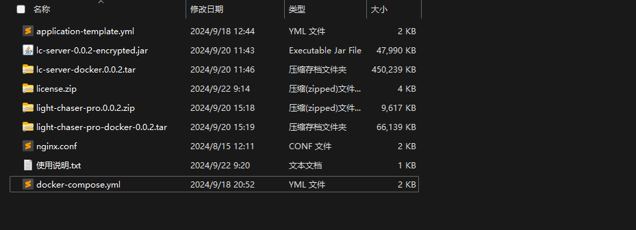

## 文件结构说明

获得LIGHT CHASER PRO部署包后其文件结构大致如下：



- application-template.yml：配置文件模版，需要根据自身环境修改
- nginx.conf：nginx配置文件模版，需要根据自身环境修改
- lc-server-0.0.2-encrypted.jar：后端应用jar包，常规部署时使用
- light-chaser-pro.0.0.2.zip：前端源码包，常规部署时使用
- lc-server-docker.0.0.2.tar: 后端应用docker镜像，docker部署时使用
- light-chaser-pro-docker.0.0.2.tar: 前端docker镜像，docker部署时使用
- license.zip ：授权文件

## 常规部署

### 前提条件

常规部署前需要自行准备好以下环境：

- JDK17运行环境
- MySQL数据库
- Nginx服务器

### 部署前端

#### 第一步：解压文件

前端部署包light-chaser-pro.0.0.2.zip解压，解压后的文件放在你的自定义目录下，例如`/usr/app` 或者 `D:\app`

#### 第二部：准备nginx

准备好nginx服务器后，将压缩包内的nginx.conf覆盖nginx默认的配置文件，并做如下调整：

> 注：如果熟悉nginx配置可根据自己需求调整配置，覆盖文件不是必选项

```nginx configuration

#user  nobody;
worker_processes  1;

#error_log  logs/error.log;
#error_log  logs/error.log  notice;
#error_log  logs/error.log  info;

#pid        logs/nginx.pid;


events {
    worker_connections  1024;
}


http {
    include       mime.types;
    default_type  application/octet-stream;

    #log_format  main  '$remote_addr - $remote_user [$time_local] "$request" '
    #                  '$status $body_bytes_sent "$http_referer" '
    #                  '"$http_user_agent" "$http_x_forwarded_for"';

    #access_log  logs/access.log  main;

    sendfile        on;
    #tcp_nopush     on;

    #keepalive_timeout  0;
    keepalive_timeout  65;

    #gzip  on;

    server {
            listen       80;
            server_name  替换为自己服务器的ip或者域名;
		
            # 替换为前解压缩文件所在目录，例如上面说的/usr/app 或者 D:\app
    	    root /usr/app;
            index index.html;

            location / {
                try_files $uri $uri/ @router;
                index index.html;
            }

            location ~ /(api|static)/ {
                    proxy_pass 替换为自己后端服务器的ip或者域名:后端服务端口;
                    proxy_set_header Host $host;
                    proxy_set_header X-Real-IP $remote_addr;
                    proxy_set_header X-Forwarded-For $proxy_add_x_forwarded_for;
                    proxy_set_header X-Forwarded-Proto $scheme;
            }

            location @router {
                rewrite ^.*$ /index.html last;
            }

            error_page   500 502 503 504  /50x.html;
            location = /50x.html {
                root   html;
            }
        }
}

```

#### 第三步：启动前端服务

使用如下命令启动nginx服务器

```shell
nginx
```

> 注：启动前可使用 `nginx -t` 命令检查配置文件是否正确

### 部署后端

#### 第一步：准备数据库

LIGHT CHASER PRO使用MySQL作为其数据库，需要提前准备好数据库，并创建名为`light_chaser-server-pro`的数据库实例(
名称可自定义，与配置文件中相同即可)。假设你的数据库链接信息如下

- 账号：root
- 密码：123456

#### 第二步：准备配置文件

下载解压后的文件，在解压后的目录下找到application-template.yml，这是一个配置模板，你需要建立一个自己的application.yml文件，并复制模板中的内容到自己的文件中，做出如下修改

```yaml
spring:
  datasource:
    type: com.alibaba.druid.pool.DruidDataSource
    driver-class-name: com.mysql.cj.jdbc.Driver
    druid:
      url: jdbc:mysql://替换为数据库所在服务器ip地址:3306/light_chaser_server-pro?serverTimezone=GMT%2B8&useUnicode=true&characterEncoding=utf-8
      username: 替换为你的数据库用户名,如root
      password: 替换为你的数据库密码，如123456
  servlet:
    multipart:
      max-file-size: 50MB # 允许上传文件的大小
      max-request-size: 50MB # 允许上传请求的大小

# mybatis-plus配置
mybatis-plus:
  type-aliases-package: com.dagu.lcserver.model
  global-config:
    db-config:
      logic-delete-field: deleted
      logic-delete-value: 1
      logic-not-delete-value: 0
  configuration:
    map-underscore-to-camel-case: true

logging:
  config: classpath:log4j2-spring.xml
  level:
    cn.jay.repository: info

light-chaser:
  license: C:/Users/DAGU/Desktop/license # 授权文件路径，加压license.zip后的文件所放置额路径
  resource-path:
    root: D:/project/light-chaser-server # 项目资源根目录
    image: /static/images # 项目产生的图片存放目录
    cover: /static/covers # 项目产生的封面图片存放目录
    avatar: /static/avatar # 用户头像存放目录
    remote-component: /static/components # 远程组件存放目录
  file:
    image-max-size: 50MB # 图片最大上传大小
  migration: # 是否自动跑sql脚本，首次运行时需要开启
    enable: true
```

#### 第三步：启动后端服务

找到`lc-server-0.0.2-encrypted.jar`，使用如下命令启动服务

```shell
java -javaagent:lc-server-0.0.2-encrypted.jar -jar lc-server-0.0.2-encrypted.jar --spring.config.location=application.yml文件所在路径
```

常规部署完毕，根据nginx配置的ip地址和端口，即可访问到LIGHT CHASER PRO

> 注：很多使用宝塔等自动化部署工具，会自带应用防火墙拦截，请确保LC所使用的端口及路由处于放行状态

## Docker部署

> 注：使用docker部署前请确保已经安装docker服务，并熟练使用docker命令

### 第一步：导入镜像

从压缩包中找到`light-chaser-pro-docker-0.0.2.tar`文件和`lc-server-docker.0.0.2.tar`文件，使用如下命令将镜像导入到docker引擎中

```shell
docker load -i lc-server-docker.0.0.2.tar
docker load -i light-chaser-pro-docker-0.0.2.tar
```

导入后使用 docker image ls 命令查看镜像是否导入成功

### 第二步：配置docker compose

找到`docker-compose.yml`文件，修改如下内容

> 注： 配置docker compose时尤其要注意路径问题，请确保路径正确。 对于docker容器而言，读取的路径始终是容器内部的路径，而不是宿主机的文件路径。不要混淆！

```yaml
version: "3"

services:
  light-chaser:
    image: "light-chaser-pro:0.0.2" # 与docker引擎中的镜像名保持一致
    container_name: light-chaser-container # 容器名，可自定义
    depends_on:
      - light-chaser-server # 依赖于light-chaser-server，先启动后端服务
    volumes: # 卷映射，配置格式为 宿主机路径:容器路径  这可是实现docker容器读取宿主机的配置文件，或者将产生的文件写入宿主机
      - /usr/app/light-chaser/default.conf:/etc/nginx/conf.d/default.conf:ro # 读取配置文件
    networks:
      - light-chaser-network
    ports:
      - "80:80"
    logging:
      driver: "json-file"
      options:
        max-size: "50m"
        max-file: "3"


  light-chaser-server:
    image: "lc-server:0.0.2"
    container_name: light-chaser-server-container
    volumes:
      - /usr/app/light-chaser-server/config/application.yml:/config/application.yml
      - /usr/app/light-chaser-server/source:/usr/app/resource
      - /usr/app/light-chaser-server/logs:/usr/app/light-chaser-server/logs
    environment:
      - SPRING_CONFIG_LOCATION=/config/application.yml
    networks:
      - light-chaser-network
    ports:
      - "8080:8080"
    logging:
      driver: "json-file"
      options:
        max-size: "50m"
        max-file: "3"


networks:
  light-chaser-network:
    driver: bridge

```

### 第三步：启动容器

当docker compose都配置完毕后，在docker-compose.yml文件所在目录使用如下命令启动容器

```shell
docker compose up  # 此命令将显示的启动前后端容器，并将日志打印到当前控制台

docker compose up -d # 此命令将后台启动前后端容器
```

启动完毕，根据nginx配置的ip地址和端口，即可访问到LIGHT CHASER PRO

