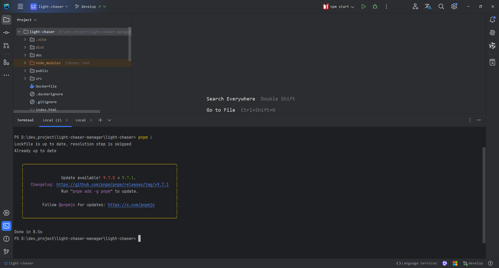
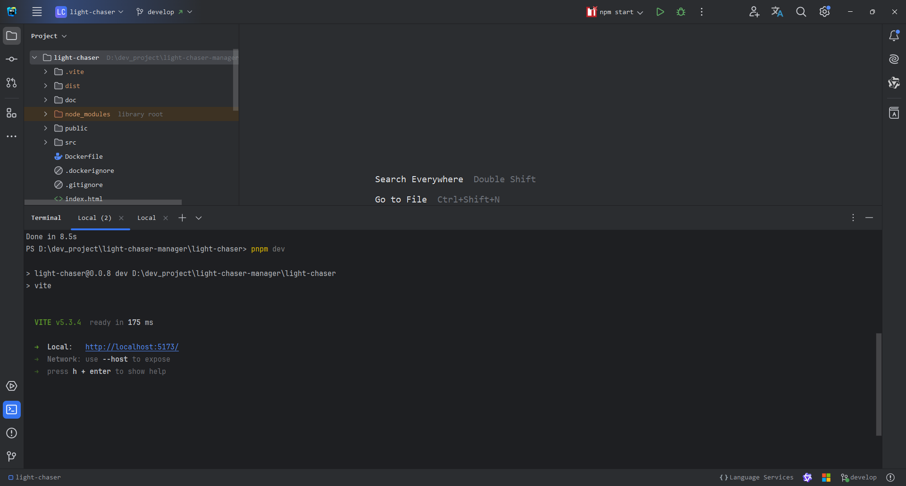
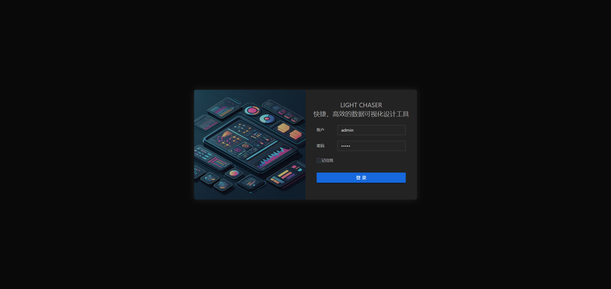
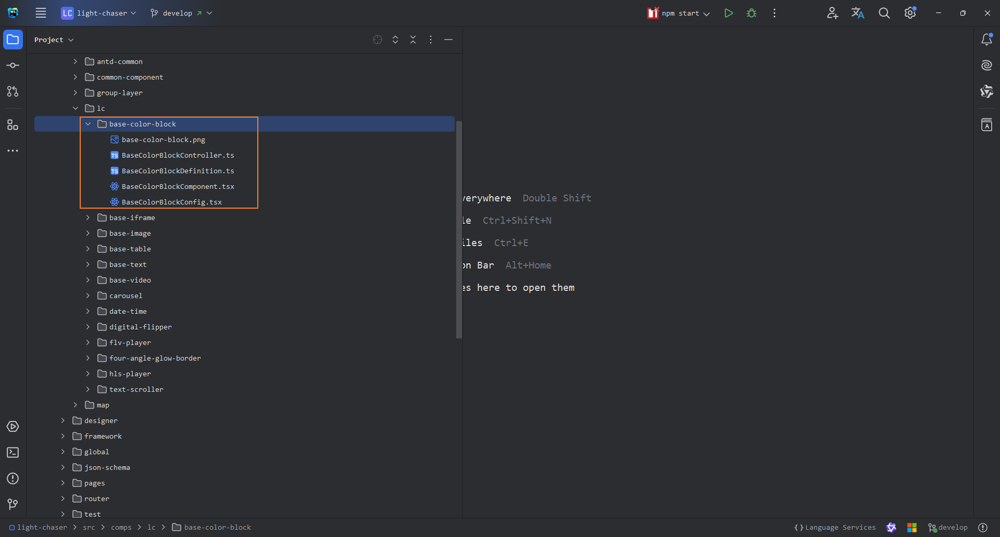
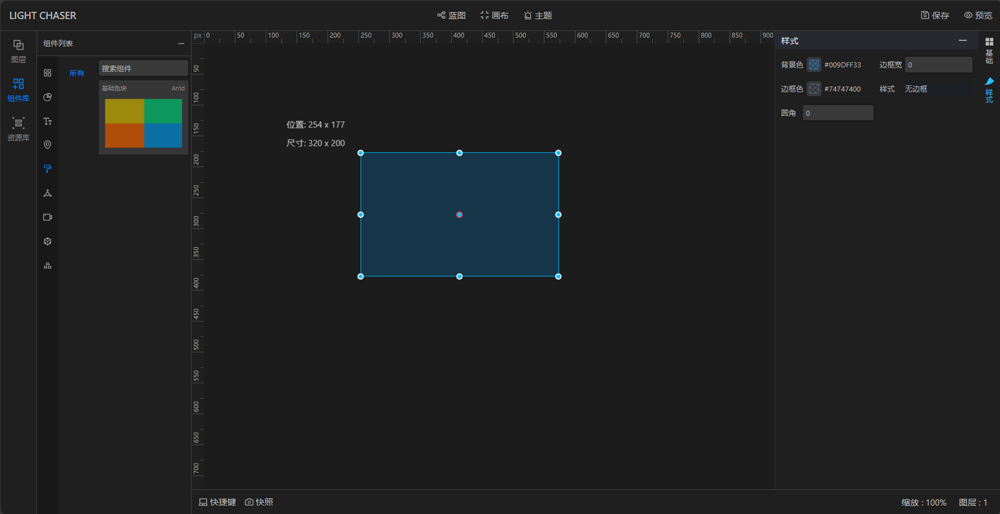

# 接入自定义组件（开源版）

> LIGHT CHASER二次开发需要熟悉前端相关技术栈，包括html、css、js、React、Vite、TypeScript、pnpm。自定义组件前请确保你已经掌握了相关技术栈

> LIGHT CHASER使用pnpm作为包管理器，为确保兼容性，请使用pnpm进行依赖管理

## 环境准备

开源版接入自定义组件需要依赖于源码，并准备好相关的开发环境。进入正式开发前请确保你已经准备好了如下环境

1. Node.js环境，推荐使用Node.js 推荐使用18往上的版本，作者使用的版本为v20.16.0
2. pnpm包管理器，若没有，请使用`npm install -g pnpm`进行安装
3. LIGHT
   CHASER源代码。代码在[GitHub](https://github.com/xiaopujun/light-chaser)、[Gitee](https://gitee.com/xiaopujun/light-chaser)
   均有开源，可自行克隆下载

#### 安装依赖

准备好上述环境后，将项目源码克隆到本地后使用`pnpm i`安装依赖



#### 启动项目

依赖安装完毕后，使用`pnpm dev`启动项目并访问`http://localhost:5173`即可查看项目效果





看到此页面后，项目已经在你本地启动了，你可以尝试使用它。这是接入自定义组件的前提条件

## 核心文件及接口概念

在LIGHT CHASER接入自定义组件的过程中一共涉及到5个必须的文件，分别是：

- definition.ts: 自定义组件信息定义文件，用于定义自定义组件的所有基础信息和初始配置数据

- controller.ts: 自定义组件控制器，用于管理自定义组件的整个生命周期，后续所有对自定义组件的操作都要依赖于controller文件的实例对象，所以理解他十分重要！

- component.tsx: 自定义的React组件，用于渲染自定义组件的UI，本质上和普通的React组件没有任何区别。事实上这个文件是非必须的，除非你完全自己实现React组件。
  对于像Echarts、G2这样的图表库而言，它们有自己的API可以直接创建页面元素

- config.tsx: 自定义组件的右侧配置面板，用于配置自定义组件的属性，本质上也是一个普通的React组件

- preview.png/jpg: 自定义组件的预览图，用于在设计器的组件列表中展示自定义组件的缩略图

如下图所示：


#### Controller定义说明

controller接口为LIGHT CHASER自定义组件接入的核心接口之一，他定义操作自定义组件生命周期的一系列标准方法。包括创建组件、修改组件配置，触发组件重新渲染等。其详细的定义如下：

> 注：controller存在一个抽象接口的继承体系，其中AbstractController是最顶级的抽象接口，其下为了功能扩展会派生出一些子接口：其中最为重要的便是AbstractDesignerController

**AbstractController定义**

```ts
export interface UpdateOptions {
    reRender: boolean;
}

/**
 * 设计器自定义组件控制器的顶级抽象接口，用于控制自定义组件的整个生命周期
 * @param I 组件实例类型，若组件为React的class组件，则I=class的实例化对象。
 * 若组件为React的函数式组件，则I=forwardRef钩子传递出的ref引用（当然你也可以有其他自定义的实现）
 * 若组件为纯Js实现的组件，则I=组件实例化对象（可参考Echarts活G2创建实例后的返回值）
 * @param C 组件配置类型，即组件的完整属性类型
 */
abstract class AbstractController<I = any, C = any> {

    /**
     * 组件实例引用
     * @protected
     */
    protected instance: I | null = null;
    /**
     * 组件配置(包括组件数据)
     * @protected
     */
    public config: C | null = null;
    /**
     * 组件所处容器的dom元素
     * @protected
     */
    public container: HTMLElement | null = null;

    /******************生命周期******************/

    /**
     * 创建组件并将组件挂载到指定的容器中
     * @param container 容器
     * @param config 组件配置
     */
    public abstract create(container: HTMLElement, config: C): Promise<void>;

    /**
     * 更新组件配置，并触发组件重新渲染
     * @param config 组件属性（参数）
     * @param upOp 操作类型
     */
    public abstract update(config: C, upOp?: UpdateOptions): void;

    /**
     * 销毁组件
     */
    public destroy(): void {
        this.instance = null;
        this.config = null;
        this.container = null;
    }


    /******************普通方法******************/
    /**
     * 获取组件配置数据
     */
    public abstract getConfig(): C | null;

}

export default AbstractController;

```

**AbstractDesignerController定义**

```ts
/**
 * AbstractDesignerController继承自AbstractController，在泛型的定义和约束上和AbstractController完全保持一致。
 * 此外，AbstractDesignerController扩展了一些自定义组件所需的特有方法，如：修改组件数据、注册蓝图事件等
 */
abstract class AbstractDesignerController<I = any, C = any> extends AbstractController<I, C> {
    //轮询请求定时器
    protected interval: NodeJS.Timeout | null = null;
    //上一次数据连接状态 true：成功 false：失败
    protected lastReqState: boolean = true;
    //断线重连标识
    protected reConnect: boolean = false;
    //异常提示信息dom元素
    private errMsgDom: HTMLElement | null = null;

    /**
     * 更新组件数据,且必须触发组件的重新渲染
     * @param data
     */
    public changeData(data: any): void {
    }

    /**
     * 用于注册组件事件，在组件接入蓝图事件系统时使用
     */
    public registerEvent(): void {
    }

    /**
     * 加载组件数据，用于在预览（展示）模式下渲染完组件后根据当前组件的数据配置自动加载并更新组件数组。
     * 注：若自定义组件有自己的数据加载方式，则需要覆写此方法
     */
    public loadComponentData(): void {
        //预览模式
        const {data} = this.config! as ComponentBaseProps;
        if (!data) return;
        const {dataSource} = data!;
        switch (dataSource) {
            case "static":
                //静态数据不做处理，组件首次渲染时默认读取静态数据
                break;
            case "api":
                const {url, method, params, header, flashFrequency = 5} = data?.apiData!;
                this.interval = setInterval(() => {
                    HttpUtil.sendHttpRequest(url!, method!, header!, params!).then((data: any) => {
                        if (data) {
                            if (!this.lastReqState) {
                                this.lastReqState = true;
                                this.errMsgDom?.remove();
                                this.errMsgDom = null;
                                this.changeData(data);
                            }
                            this.changeData(data);
                        }
                    }).catch(() => {
                        this.lastReqState = false;
                        //请求失败，在原有容器的基础上添加异常提示信息的dom元素（此处直接操作dom元素，不适用react的api进行组件的反复挂载和卸载）
                        if (!this.errMsgDom) {
                            this.errMsgDom = document.createElement("div");
                            this.errMsgDom.classList.add("view-error-message");
                            this.errMsgDom.innerText = "数据加载失败...";
                            this.container!.appendChild(this.errMsgDom);
                        }
                    });
                }, flashFrequency * 1000);
                break;
        }
    }

    /**
     * 更新本组件的主题样式方法，用于在全局切换主题时使用
     * @param newTheme 新主题
     */
    public updateTheme(newTheme: ThemeItemType): void {
    }

}

export default AbstractDesignerController;

```

#### Definition定义说明

definition.ts 是定义组件所有基础信息和初始化数据的文件，其完整结构如下：

```ts
/**
 * 自动扫描抽象组件定义核心类。
 * 对于所有继承并实现了该抽象类的子类，都会被自动扫描到并注册到设计器中。
 * 因此，所有要接入设计器的react组件都应该按照该类的约定实现其所有的方法。
 *
 * 泛型说明：
 * C: 组件控制器类，用于指定当前组件定义对应的控制器类
 * P: 组件配置类型，用于指定当前组件的配置数据(config属性的类型)
 */
export abstract class AbstractDefinition<C extends AbstractController = AbstractController, P = any> {

    /**
     * 返回组件基础信息，用于在组件列表中展示
     */
    abstract getBaseInfo(): BaseInfoType ;

    /**
     * 返回组件的初始配置，用于在画布渲染组件时的初始化组件数据
     */
    abstract getInitConfig(): P;

    /**
     * 返回React组件Controller控制器的类模板，在画布中创建组件实例时会根据该方法的返回值实例化组件控制器并保存。
     * 后续将通过该控制器的实例对象来控制组件的生命周期
     */
    abstract getController(): ClazzTemplate<C> | null;

    /**
     * 返回组件图片缩略图，在组件列表中展示时使用。图片尺寸越小越好
     */
    abstract getChartImg(): string | null;

    /**
     * 返回右侧配置菜单列表，双击组件时需要展示该菜单列表
     */
    abstract getMenuList(): Array<MenuInfo> | null;

    /**
     * 返回右侧菜单与对应配置内容组件的映射关系
     */
    abstract getMenuToConfigContentMap(): MenuToConfigMappingType | null;

    /**
     * 返回当前组件能触发的事件列表, 在蓝图图层节点中使用
     */
    getEventList(): EventInfo[] {
        return [
            {
                id: "loaded",
                name: "组件加载完成时",
            }
        ];
    }

    /**
     * 返回当前组件能接受的动作列表，在蓝图图层节点中使用。可据此实现对组件的操作
     */
    getActionList(): ActionInfo[] {
        return [
            {
                name: "显示",
                id: "show",
                handler: (controller: AbstractController) => {
                    controller.container!.style.display = "block";
                }
            },
            {
                name: "隐藏",
                id: "hide",
                handler: (controller: AbstractController) => {
                    controller.container!.style.display = "none";
                }
            },
            {
                name: "更新组件配置",
                id: "updateConfig",
                handler: (controller: AbstractController, params?: object) => {
                    controller.update(params);
                }
            }
        ];
    }

    /**
     * 自定义组件主分类，如需要创建一个设计器没有提供的主分类，则实现该方法
     */
    getCategorize(): ICategorize | null {
        return null;
    }

    /**
     * 自定义组件子分类,如需要创建一个设计器没有提供的子分类，则实现该方法
     */
    getSubCategorize(): ICategorize | null {
        return null;
    }
}
```

如上，我们介绍了接入自定义组件过程中最重要的两个核心文件controller.ts和definition.ts，请务必重点理解这两个文件的作用和使用方法。

## 接入自定义组件

以接入一个自定义的颜色块组件为例，我们将在本节中展示接入自定义组件的步骤的完整示例代码。

### 准备工作

1. 请按照 [环境准备](/develop/develop_open?id=%e7%8e%af%e5%a2%83%e5%87%86%e5%a4%87) 章节步骤，将项目克隆到本地运行起来。
2. 在src/comps目录下任意位置新建一个文件夹，例如：src/lc/base-color-block（这个文件夹将用于存放所有与你组件相关的信息）
3. 准备好组件缩略图放在src/lc/base-color-block目录下，例如：src/lc/base-color-block/base-color-block.png

### 第一步：实现普通的React组件

此处以React函数式组件为例

```tsx
import React, {ForwardedRef, useImperativeHandle, useRef, useState} from 'react';
import {ComponentInfoType} from "../../common-component/common-types";

/**
 * 颜色块组件的样式数据类型
 */
export interface BaseColorBlockComponentStyle {
    borderRadius?: number;
    borderWidth?: number;
    borderColor?: string;
    borderStyle?: string;
    background?: string;
}

/**
 * 颜色块组件的完整配置项类型
 */
export interface BaseColorBlockComponentProps {
    base?: ComponentInfoType;
    style?: BaseColorBlockComponentStyle; //取自上面的BaseColorBlockComponentStyle
}

/**
 * 颜色块组件的ref类型，用于暴露给设计器controller使用，与class组件的实例化对象同理
 */
export interface BaseColorBlockComponentRef {
    updateConfig: (newConfig: BaseColorBlockComponentProps) => void;
    setEventHandler: (eventMap: Record<string, Function>) => void;
}

const BaseColorBlockComponent = React.forwardRef((props: BaseColorBlockComponentProps,
                                                  ref: ForwardedRef<BaseColorBlockComponentRef>) => {
    const [config, setConfig] = useState<BaseColorBlockComponentProps>({...props});

    const eventHandlerMap = useRef<Record<string, Function>>({});

    /**
     * 将函数式组件内部的方法与ref绑定，暴露给controller使用
     */
    useImperativeHandle(ref, () => ({
        updateConfig: (newConfig) => setConfig({...newConfig}),
        setEventHandler: (eventMap) => eventHandlerMap.current = eventMap,
    }));

    /**
     * 点击事件处理，若需要接入蓝图，则需要配合controller和definition中蓝图相关的的方法配合使用
     */
    const onClick = () => {
        if ('click' in eventHandlerMap.current) {
            eventHandlerMap.current['click']();
        }
    }

    const {style} = config;
    return (
        <div style={{...{height: '100%', display: 'flex'}, ...style}} onClick={onClick}/>
    );
});

export default BaseColorBlockComponent;
```

### 第二步：实现配置组件

> 配置组件使用了json schema方式动态生成配置面板。详细信息请参考[组件库章节](develop/ui.md)。
> 若不喜欢这种形式，你也可以使用普通React组件的方式处理配置项。不过强烈建议使用json schema。此种方式效率更高，并且UI风格统一

```tsx
import React from 'react';
import {FieldChangeData, LCGUI} from "../../../json-schema/LCGUI";
import {Control} from "../../../json-schema/SchemaTypes";
import {BaseColorBlockController} from "./BaseColorBlockController";
import {ConfigType} from "../../../designer/right/ConfigContent";

/**
 * 颜色块组件的配置项组件，本质上就是一个React组件。该组件的props中设计器会统一传入一个controller对象，可使用该对象完成对组件配置的更新
 */
export const BaseColorBlockConfig: React.FC<ConfigType<BaseColorBlockController>> = ({controller}) => {

    const {background, borderWidth, borderColor, borderStyle, borderRadius} = controller.getConfig()?.style!;

    const onFieldChange = (fieldChangeData: FieldChangeData) => {
        const {dataFragment} = fieldChangeData;
        controller.update(dataFragment);
    }

    const schema: Control = {
        key: 'style',
        type: 'grid',
        config: {columns: 2},
        children: [
            {
                key: 'background',
                type: 'color-picker',
                label: '背景色',
                value: background,
                config: {
                    width: '100%',
                    radius: 3,
                    showBorder: true,
                    showText: true,
                    height: 16,
                    hideControls: true
                }
            },
            {
                key: 'borderWidth',
                type: 'input',
                label: '边框宽',
                value: borderWidth,
                config: {
                    width: '100%',
                    type: 'number',
                    min: 0,
                    max: 10,
                    step: 1
                }
            },
            {
                key: 'borderColor',
                type: 'color-picker',
                label: '边框色',
                value: borderColor,
                config: {
                    width: '100%',
                    radius: 3,
                    showBorder: true,
                    showText: true,
                    height: 16,
                    hideControls: true
                }
            },
            {
                key: 'borderStyle',
                type: 'select',
                label: '样式',
                value: borderStyle,
                config: {
                    options: [
                        {label: '实线', value: 'solid'},
                        {label: '虚线', value: 'dashed'},
                        {label: '点线', value: 'dotted'},
                        {label: '双线', value: 'double'},
                        {label: '3D凹槽', value: 'groove'},
                        {label: '3D垄状', value: 'ridge'},
                        {label: '3D内嵌', value: 'inset'},
                        {label: '3D外嵌', value: 'outset'},
                        {label: '无边框', value: 'none'},
                    ]
                }
            },
            {
                key: 'borderRadius',
                type: 'input',
                label: '圆角',
                value: borderRadius,
                config: {
                    width: '100%',
                    type: 'number',
                    min: 0,
                }
            },
        ]
    }

    /**
     * LCGUI组件是一个json schema的解析组件，用于将json schema解析成对应的配置项组件
     * 该解析组件由设计器提供，使用者无需关心。仅需按照其约定的方式使用即可。下一节会详细介绍该组件的使用
     *
     * 或者你也可以完全按照普通react组件的方式来实现配置项组件
     */
    return (
        <LCGUI schema={schema} onFieldChange={onFieldChange}/>
    )
}
```

### 第三步：实现控制器

```tsx
import {ThemeItemType} from "../../../designer/DesignerType";
import {UpdateOptions} from "../../../framework/core/AbstractController";
import AbstractDesignerController from "../../../framework/core/AbstractDesignerController";
import ComponentUtil from "../../../utils/ComponentUtil";
import BaseColorBlockComponent, {
    BaseColorBlockComponentProps,
    BaseColorBlockComponentRef
} from "./BaseColorBlockComponent";
import ObjectUtil from "../../../utils/ObjectUtil";
import BPExecutor from "../../../blueprint/core/BPExecutor";

export class BaseColorBlockController extends AbstractDesignerController<BaseColorBlockComponentRef, BaseColorBlockComponentProps> {

    async create(container: HTMLElement, config: BaseColorBlockComponentProps): Promise<void> {
        this.config = config;
        this.container = container;
        // 创建组件实例，ComponentUtil是一个组件工具类，有设计器提供。也可以自己实现
        this.instance = await ComponentUtil.createAndRender<BaseColorBlockComponentRef>(container, BaseColorBlockComponent, config);
    }

    destroy(): void {
        this.instance = null;
        this.config = null;
    }

    getConfig(): BaseColorBlockComponentProps | null {
        return this.config;
    }

    /**
     * 更新组件配置，你可以在此处完成对组件配置的更新并触发组件的重新渲染
     */
    update(config: BaseColorBlockComponentProps, upOp?: UpdateOptions | undefined): void {
        this.config = ObjectUtil.merge(this.config, config);
        upOp = upOp || {reRender: true};
        if (upOp.reRender)
            this.instance?.updateConfig(this.config!);
    }

    /**
     * 更新组件主题，你可以在此处完成对组件主题的更新并触发组件的重新渲染
     * 没有接入主题要求的组件可以不实现该方法
     */
    updateTheme(newTheme: ThemeItemType): void {

    }

    /**
     * 蓝图事件注册，你可以在此处完成对组件蓝图事件的注册
     * 该方法的实现需要在React组件文件中做一些额外的工作，即需要在组件事件触发后，通过唯一key匹配到该方法返回的事件处理函数上
     *
     * 蓝图会根据该机制触发组件事件并不断流转到下一个节点，直到事件链路处理完毕
     */
    registerEvent() {
        const nodeId = this.config?.base?.id!;
        this.instance?.setEventHandler({
            click: () => BPExecutor.triggerComponentEvent(nodeId!, "click", this.config),
        })
    }
}
```

### 第四步：实现Definition

```tsx
import {
    AbstractDefinition, BaseInfoType, EventInfo,
    MenuToConfigMappingType
} from "../../../framework/core/AbstractDefinition";
import {ClazzTemplate} from "../../common-component/common-types";
import {MenuInfo} from "../../../designer/right/MenuType";
import baseColorBlockImg from './base-color-block.png';
import {getDefaultMenuList} from "../../../designer/right/util";
import {BaseColorBlockController} from "./BaseColorBlockController";
import {BaseColorBlockComponentProps} from "./BaseColorBlockComponent";
import BaseInfo from "../../common-component/base-info/BaseInfo";
import AnimationConfig from "../../common-component/animation-config/AnimationConfig";
import ThemeConfig from "../../common-component/theme-config/ThemeConfig";
import {BaseColorBlockConfig} from "./BaseColorBlockConfig";

export default class BaseColorBlockDefinition extends AbstractDefinition<BaseColorBlockController, BaseColorBlockComponentProps> {
    getBaseInfo(): BaseInfoType {
        return {
            compName: "基础色块",
            compKey: "BaseColorBlock",
            categorize: "ornament",
        };
    }

    getChartImg(): string | null {
        return baseColorBlockImg;
    }

    getController(): ClazzTemplate<BaseColorBlockController> | null {
        return BaseColorBlockController;
    }

    getInitConfig(): BaseColorBlockComponentProps {
        return {
            base: {
                id: "",
                name: '基础色块',
                type: 'BaseColorBlock',
            },
            style: {
                background: '#009DFF33',
                borderRadius: 0,
                borderWidth: 0,
                borderColor: '#74747400',
                borderStyle: 'none',
            },
        };
    }

    getMenuList(): Array<MenuInfo> | null {
        return getDefaultMenuList().filter((item: MenuInfo) => (item.key !== 'theme' && item.key !== 'data' && item.key !== 'mapping'));
    }

    getMenuToConfigContentMap(): MenuToConfigMappingType | null {
        return {
            base: BaseInfo,
            style: BaseColorBlockConfig,
            animation: AnimationConfig,
            theme: ThemeConfig
        };
    }

    getEventList(): EventInfo[] {
        const events = super.getEventList();
        return events.concat([
            {
                id: "click",
                name: "点击时",
            }
        ]);
    }
}
```

### 第五步：完成接入

经过上面的所有步骤后，你的文件夹下应该有如下文件：



检查无误后启动你的开发环境，剩下的交给设计器，他会扫描并加载你的组件到设计器中。打开浏览器访问地址，你应该可以看到你的组件已经接入到设计器中了。



