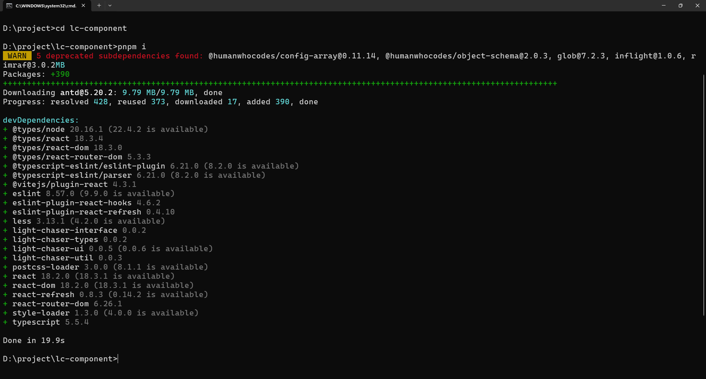

## 总览

Pro版接入自定义组件的方式与开源版略有不同，它以服务器组件的方式实现。需要使用LIGHT
CHASER提供的官方脚手架来创建自定义组件。而不需要下载源码。此种方式更简洁明了

## 环境准备

Pro版本是私有化部署的，因此一定会与后端结合起来使用。因此当前开发一个Pro版的自定义组件，整个LIGHT CHASER
PRO一定已经启动完成了。具体部署可参考[Pro版部署](deploy/deploy_pro.md)。如果你已经购买了Pro版，作者会协助你完成部署

其他的环境准备与开源版一样，Node.js、pnpm包管理是必须的

当上面的都准备好了之后，你需要全局安装LIGHT CHASER提供的开发脚手架

```shell
npm install -g light-chaser-cli
```

安装完毕后使用使用light-chaser-cli -V或者light-chaser-cli --version命令查看版本号.


如上图显示说明安装成功。

## 创建项目

使用`light-chaser-cli create <workspace>`命令创建一个自定义组件项目


## 安装依赖

脚手架创建的项目同样建议使用pnpm进行依赖管理，使用`pnpm i`命令安装项目依赖



## 启动项目

依赖安装完毕后使用`light-chaser-cli dev`命令启动项目


访问 http://localhost:3000/ 即可看到项目列表


## 编写组件

当你用IDE打开脚手架创建的目录后，其所有内容如下图所示。可以发现整个目录是比较简洁的。目录结构几乎与开源版没有任何区别。每个文件的作用和组件的编写方式与开源版也是类似的。具体可参考[开源版开发文档](develop/develop_open?id=核心文件及接口概念)


> 注意：Pro版本的脚手架中每个目录下的文件命名最好与示例保持一致不要单独调整。特别是definition.ts文件。不要改动文件名。

## 打包组件

当你的组件编写测试完成之后，使用`light-chaser-cli build`命令打包组件，会在dist目录下生成一个组件包。


打开主设计器，并查看组件列表，你应该可以看到刚才上传的组件。组件的操作与默认集成的标准组件没有任何区别

