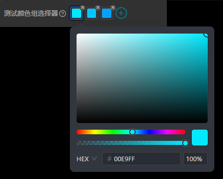
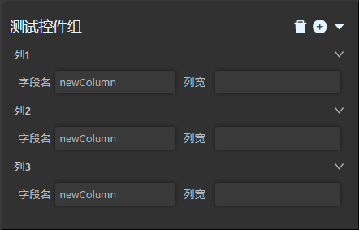

## 简介

LIGHT CHASER 配置组件库 - JSON Schema UI 是一套用于组件配置项的组件库，它可用于快速生成组件的配置项面板。


> 为什么要使用组件配置项组件库？

在实际开发过程中使用 JSON Schema UI 确实是非必选项，这意味着你可以使用常规的 React 组件来实现组件配置项面板，但是这样做会有以下几个问题：

1. 效率低：需要手动编写大量的表单组件，这些表单组件的样式、布局、校验等都需要自己编写，这些工作都是重复的，而且容易出错。
2. 维护成本高：当组件配置项发生变化时，需要手动修改表单组件，这些修改也是重复的，而且容易出错。
3. 代码冗余：每个表单组件都需要编写样式、布局等，这些代码都是重复的，而且容易出错。
4. UI风格不统一：每个表单组件都需要编写样式，这些样式都是不同的，这样会导致组件配置项面板的UI风格不统一。

> JSON Schema UI 是如何解决这些问题的？

JSON Schema UI 是一套基于 JSON Schema 的组件库，组件库内提供了配置项中所需要的常用配置组件，比如：输入框，下拉框，开关等。他们的UI风格是统一的。 基于这个组件库。LIGHT
CHASER提供了一个解析组件和一套标准的配置项数据结构。仅需要按照该数据结构配置数据，并传递给解析组件，即可自动生成配置项面板，且事件处理也是灵活的。

## 快速开始

使用 JSON Schema UI 非常简单。你可以像使用常规的 React 组件一样使用它。如下是一个简单的示例：

```tsx
import './DemoMain.less';
import {Control} from "../json-schema/SchemaTypes";
import {FieldChangeData, LCGUI} from "../json-schema/LCGUI";

export default function DemoMain() {

    const schema: Control = {
        type: 'accordion',
        label: '手风琴',
        children: [
            {
                type: 'grid',
                children: [
                    {
                        type: 'input',
                        label: '输入框',
                        value: 'demo',
                    },
                    {
                        type: 'select',
                        label: '下拉框',
                        value: '1',
                        config: {
                            options: [
                                {label: '选项1', value: '1'},
                                {label: '选项2', value: '2'},
                                {label: '选项3', value: '3'},
                            ]
                        }
                    },
                    {
                        type: 'switch',
                        label: '开关',
                        value: true,
                    }
                ]
            }
        ]
    }

    const onFieldChange = (fieldChangeData: FieldChangeData) => {
        console.log(fieldChangeData);
    }

    return (
        <div style={{width: 300, padding: 10}}>
            <LCGUI schema={schema} onFieldChange={onFieldChange}/>
        </div>
    )
}
```

仅需上面简单的配置即可解析渲染得到如下的配置面板


## schema数据结构

json schema的控件数据类型定义如下：

```typescript
export type UIType =
    "accordion" |           //手风琴
    "button" |              //按钮
    "grid" |                //网格布局
    "input" |               //输入框
    "radio" |               //单选框
    "select" |              //下拉框
    "switch" |              //开关
    "code-editor" |         //代码编辑器
    "color-picker" |        //颜色选择器
    "colors-picker" |       //颜色选择器组
    "color-mode" |          //颜色模式选择器，支持单色和多色模式
    "image-upload" |        //图片上传
    "text-only" |           //仅文本
    "text-area" |           //文本域
    "slider" |              //滑块
    "group-button" |        //按钮组
    "control-group" |       //控件组
    "number-input" |        //数字输入框
    "item-panel";           //控件面板

export interface Control {
    /**
     * 控件id，当需要对控件值进行特殊处理时，可设置id进行标识
     */
    id?: string;
    /**
     * 当前层级的控件对应的key，用于链接每层控件的key形成最终要修改的数据对象
     * 有key则需要作为数据更新片段链条的一部分，无key则数据片段自动跳过本层级，应该直接连接父级和子级
     */
    key?: string;
    /**
     * 控件标题，有label应该渲染label，无label则直接渲染控件
     */
    label?: string;
    /**
     * 控件类型，可选的控件类型请参考上面的UIType定义
     */
    type?: UIType;//有type则需要渲染控件，无type则直接忽略本层级的渲染
    /**
     * 控件提示信息
     */
    tip?: string;
    /**
     * 控件值
     */
    value?: ControlValueType;
    /**
     * 控件配置项，不同的控件有不同的配置项，具体请参考各个控件的定义
     */
    config?: Record<string, any>;
    /**
     * 控件显隐规则
     */
    rules?: string;
    /**
     * 标识该控件的值发生变更后是否需要触发整个schema的重新渲染，若该值为true，则当前控件为受控状态，及其值是否发生变化依赖于外部传递的值。其状态也由外部管理而非自身管理
     */
    reRender?: boolean;
    /**
     * 子控件
     */
    children?: Control[];
    /**
     * 父控件，该属性在组件解析过程中动态赋值，无需手动设置。用于在控件规则校验时的向上数据回溯使用
     */
    parent?: Control;
}
```

## 数据变更事件

在使用json schema的过程中，每一个控件的值发生变化都会触发一个事件，该事件会通过onFieldChange回调函数传递给外部。你可以在该回调函数中处理控件值的变更。该回调函数的定义如下：

```typescript
export interface FieldChangeData {
    /**
     * schema控件中设置好的id，未设置则为undefined
     */
    id?: string;
    /**
     * 发生数据变更的控件所产出的数据
     */
    data: ControlValueType;
    /**
     * schema控件中设置的reRender属性值
     */
    reRender?: boolean;
    /**
     * 当前控件在schema配置项中的key路径
     */
    schemaKeyPath: SchemaPathNode[];
    /**
     * 当前控件在schema配置项中key属性的完整路径
     */
    dataKeyPath: string[];
    /**
     * 当前控件值变更后对应的完整数据片段
     */
    dataFragment: object;
}

export interface LCGUIProps {
    schema: Control;
    /**
     * 控件值变更回调函数fieldChangeData
     */
    onFieldChange?: (fieldChangeData: FieldChangeData) => void;
}
```

为了尽可能减少使用者处理数据时的工作量，json schema实现了对象链路拼接的功能。对应事件回调函数中的dataFragment属性。其效果如下：

以下面这段schema为例。

```typescript
const schema: Control = {
    key: 'user',
    type: 'accordion',
    label: '手风琴',
    children: [
        {
            type: 'grid',
            children: [
                {
                    key: 'name',
                    type: 'input',
                    label: '输入框',
                    value: 'demo',
                },
                {
                    key: 'sex',
                    type: 'select',
                    label: '下拉框',
                    value: '1',
                    config: {
                        options: [
                            {label: '选项1', value: '1'},
                            {label: '选项2', value: '2'},
                            {label: '选项3', value: '3'},
                        ]
                    }
                },
                {
                    key: 'isStudent',
                    type: 'switch',
                    label: '开关',
                    value: true,
                }
            ]
        }
    ]
}
```

当key为name的控件数据变更时，onFieldChange函数中的dataFragment属性值为：

```typescript
{
    user:{
        name:'demo'
    }
}
```

其他控件亦是如此。这将得到你最终所需要的数据对象的一个数据片段。将数据片段与旧数据融合即可得到完整最新的数据对象。之后可以设置给指定的图表组件以展示最新的组件效果。

## 组件列表

### 手风琴


> 示例代码

```tsx

export default function Demo() {

    const schema: Control = {
        type: 'accordion',
        label: '手风琴',
        children: [
            {
                type: 'switch',
                label: '开关',
            }
        ]
    }

    const onFieldChange = (fieldChangeData: FieldChangeData) => {
        console.log(fieldChangeData);
    }

    return (
        <div style={{width: 300, padding: 10, background: '#313131'}}>
            <LCGUI schema={schema} onFieldChange={onFieldChange}/>
        </div>
    )
}
```

> API（属性说明）

| 属性名 | 类型 | 默认值 | 说明 |
| --- | --- | --- | --- |
| label | string | - | 手风琴控件标题 |
| tip | string | - | 手风琴控件提示信息 |
| showSwitch | boolean | false | 是否展示手风琴控件开关 |
| onChange | (data: boolean) => void; | - | 开关值变更回调函数 |
| value | boolean | - | 控件值 |
| defaultValue | boolean | - | 控件默认值 |

### 按钮


> 示例代码

```tsx
export default function DemoMain() {

    const schema: Control = {
        type: 'button',
        config: {
            children: '按钮',
        }
    }

    const onFieldChange = (fieldChangeData: FieldChangeData) => {
        console.log(fieldChangeData);
    }

    return (
        <div style={{width: 300, padding: 10, background: '#313131'}}>
            <LCGUI schema={schema} onFieldChange={onFieldChange}/>
        </div>
    )
}
```

> API（属性说明）

| 属性名 | 类型 | 默认值 | 说明 |
| --- | --- | --- | --- |
| children | ComponentType | - | 按钮内容 |

### 网格布局


> 示例代码

```tsx
export default function Demo() {

    const schema: Control = {
        type: 'grid',
        label: '测试Grid布局',
        tip: '这是一个测试Grid布局的示例',
        config: {
            columns: 2,
        },
        children: [
            {
                type: 'input',
                label: 'Name',
                value: 'John',
            },
            {
                type: 'input',
                label: 'Age',
                value: 18,
            },
            {
                type: 'input',
                label: 'Address',
                value: 'New York No. 1 Lake Park',
            }
        ]
    }

    const onFieldChange = (fieldChangeData: FieldChangeData) => {
        console.log(fieldChangeData);
    }

    return (
        <div style={{width: 600, padding: 10, background: '#313131'}}>
            <LCGUI schema={schema} onFieldChange={onFieldChange}/>
        </div>
    )
}
```

> API（属性说明）

| 属性名 | 类型 | 默认值 | 说明 |
| --- | --- | --- | --- |
| columns | number | - | grid布局列数 |
| gridGap | string | - | 元素间隔 |

### 输入框


> 示例代码

```tsx
export default function Demo() {

    const schema: Control = {
        type: 'input',
        label: '测试input',
        tip: '这是一个测试',
        value: '测试值',
        config: {
            placeholder: '请输入',
            disabled: false,
        }
    }

    const onFieldChange = (fieldChangeData: FieldChangeData) => {
        console.log(fieldChangeData);
    }

    return (
        <div style={{width: 600, padding: 10, background: '#313131'}}>
            <LCGUI schema={schema} onFieldChange={onFieldChange}/>
        </div>
    )
}
```

> API（属性说明）

| 属性名 | 类型 | 默认值 | 说明 |
| --- | --- | --- | --- |
| label | string | - | 控件标题 |
| tip | string | - | 控件提示信息 |
| placeholder | string | - | 输入框提示信息 |
| disabled | boolean | false | 是否禁用 |
| onChange | (data: string) => void | - | 输入框值变更回调函数 |

### 数字输入框


> 示例代码

```tsx
export default function Demo() {

    const schema: Control = {
        type: 'number-input',
        label: '测试input',
        tip: '这是一个数值输入框',
        value: '测试值',
        config: {
            min: 0,
            max: 100,
            step: 1,
            disabled: false,
        }
    }

    const onFieldChange = (fieldChangeData: FieldChangeData) => {
        console.log(fieldChangeData);
    }

    return (
        <div style={{width: 600, padding: 10, background: '#313131'}}>
            <LCGUI schema={schema} onFieldChange={onFieldChange}/>
        </div>
    )
}
```

> API（属性说明）

| 属性名 | 类型 | 默认值 | 说明 |
| --- | --- | --- | --- |
| label | string | - | 控件标题 |
| tip | string | - | 控件提示信息 |
| min | string | - | 输入框最小值 |
| max | number | - | 输入框最大值 |
| step | number | - | 输入框步长 |
| disabled | boolean | false | 是否禁用 |
| onChange | (data: string) => void | - | 输入框值变更回调函数 |

### 单选框


> 示例代码

```tsx
export default function Demo() {

    const schema: Control = {
        type: 'radio',
        label: '测试Radio',
        tip: '这是一个Radio',
        value: '2',
        config: {
            disabled: false,
            options: [
                {label: '选项1', value: '1'},
                {label: '选项2', value: '2'},
            ]
        }
    }

    const onFieldChange = (fieldChangeData: FieldChangeData) => {
        console.log(fieldChangeData);
    }

    return (
        <div style={{width: 600, padding: 10, background: '#313131'}}>
            <LCGUI schema={schema} onFieldChange={onFieldChange}/>
        </div>
    )
}
```

> API（属性说明）

| 属性名 | 类型 | 默认值 | 说明 |
| --- | --- | --- | --- |
| label | string | - | 控件标题 |
| tip | string | - | 控件提示信息 |
| value | string | - | 值 |
| defaultValue | string | - | 默认值 |
| disabled | boolean | - | 是否禁用 |
| options | RadioOption | - | radio选项列表 |

### 下拉框


> 示例代码

```tsx
export default function Demo() {

    const schema: Control = {
        type: 'select',
        label: '测试下拉框',
        tip: '这是一个下拉框',
        value: '2',
        config: {
            disabled: false,
            placeholder: '请选择',
            options: [
                {label: '选项1', value: '1'},
                {label: '选项2', value: '2'},
            ]
        }
    }

    const onFieldChange = (fieldChangeData: FieldChangeData) => {
        console.log(fieldChangeData);
    }

    return (
        <div style={{width: 600, padding: 10, background: '#313131'}}>
            <LCGUI schema={schema} onFieldChange={onFieldChange}/>
        </div>
    )
}
```

> API（属性说明）

| 属性名 | 类型 | 默认值 | 说明 |
| --- | --- | --- | --- |
| label | string | - | 控件标题 |
| tip | string | - | 控件提示信息 |
| value | string | - | 值 |
| defaultValue | string | - | 默认值 |
| disabled | boolean | - | 是否禁用 |
| options | ISelectOption | - | select选项列表 |
| placeholder | RadioOption | - | 选择框默认文字 |

### 开关


> 示例代码

```tsx
export default function Demo() {

    const schema: Control = {
        type: 'switch',
        label: '测试开关',
        tip: '这是一个开关',
        value: false,
        config: {
            disabled: false,
        }
    }

    const onFieldChange = (fieldChangeData: FieldChangeData) => {
        console.log(fieldChangeData);
    }

    return (
        <div style={{width: 600, padding: 10, background: '#313131'}}>
            <LCGUI schema={schema} onFieldChange={onFieldChange}/>
        </div>
    )
}
```

> API（属性说明）

| 属性名 | 类型 | 默认值 | 说明 |
| --- | --- | --- | --- |
| label | string | - | 控件标题 |
| tip | string | - | 控件提示信息 |
| value | string | - | 值 |
| defaultValue | string | - | 默认值 |
| disabled | boolean | - | 是否禁用 |

### 仅文本


> 示例代码

```tsx
export default function Demo() {

    const schema: Control = {
        type: 'text-only',
        label: '测试仅文本',
        tip: '这是一个仅文本',
        value: '这是一个仅文本',
    }

    const onFieldChange = (fieldChangeData: FieldChangeData) => {
        console.log(fieldChangeData);
    }

    return (
        <div style={{width: 600, padding: 10, background: '#313131'}}>
            <LCGUI schema={schema} onFieldChange={onFieldChange}/>
        </div>
    )
}
```

> API（属性说明）

| 属性名 | 类型 | 默认值 | 说明 |
| --- | --- | --- | --- |
| label | string | - | 控件标题 |
| tip | string | - | 控件提示信息 |
| defaultValue | string | - | 默认值 |

### 文本域


> 示例代码

```tsx
export default function Demo() {

    const schema: Control = {
        type: 'text-area',
        label: '测试文本域',
        tip: '这是一个文本域',
        value: '文本域测试数据',
    }

    const onFieldChange = (fieldChangeData: FieldChangeData) => {
        console.log(fieldChangeData);
    }

    return (
        <div style={{width: 600, padding: 10, background: '#313131'}}>
            <LCGUI schema={schema} onFieldChange={onFieldChange}/>
        </div>
    )
}
```

> API（属性说明）

| 属性名 | 类型 | 默认值 | 说明 |
| --- | --- | --- | --- |
| label | string | - | 控件标题 |
| tip | string | - | 控件提示信息 |
| value | string | - | 值 |
| defaultValue | string | - | 默认值 |

### 滑块


> 示例代码

```tsx
export default function Demo() {

    const schema: Control = {
        type: 'slider',
        label: '测试滑块',
        tip: '这是一个滑块',
        value: 20,
    }

    const onFieldChange = (fieldChangeData: FieldChangeData) => {
        console.log(fieldChangeData);
    }

    return (
        <div style={{width: 600, padding: 10, background: '#313131'}}>
            <LCGUI schema={schema} onFieldChange={onFieldChange}/>
        </div>
    )
}
```

> API（属性说明）

| 属性名 | 类型 | 默认值 | 说明 |
| --- | --- | --- | --- |
| label | string | - | 控件标题 |
| tip | string | - | 控件提示信息 |
| value | string | - | 值 |
| defaultValue | string | - | 默认值 |
| max | number | - | 最大值 |
| min | number | - | 最小值 |
| step | number | - | 步长 |

### 按钮组


> 示例代码

```tsx
export default function Demo() {

    const schema: Control = {
        type: 'group-button',
        label: '测试按钮组',
        tip: '这是一个按钮组',
        config: {
            items: [
                {
                    value: 'btn1',
                    content: '钮1'
                },
                {
                    value: 'btn2',
                    content: '钮2'
                },
                {
                    value: 'btn3',
                    content: '钮3'
                },
            ]
        }
    }

    const onFieldChange = (fieldChangeData: FieldChangeData) => {
        console.log(fieldChangeData);
    }

    return (
        <div style={{width: 300, padding: 10, background: '#313131'}}>
            <LCGUI schema={schema} onFieldChange={onFieldChange}/>
        </div>
    )
}
```

> API（属性说明）

| 属性名 | 类型 | 默认值 | 说明 |
| --- | --- | --- | --- |
| label | string | - | 控件标题 |
| tip | string | - | 控件提示信息 |
| value | string | - | 按钮点击时向外传递的key |
| content | ReactNode/string | - | 按钮内部元素 |

### 代码编辑器


> 示例代码

```tsx
export default function Demo() {

    const schema: Control = {
        type: 'code-editor',
        label: '测试代码编辑器',
        tip: '这是一个代码编辑器',
        value: 'console.log("hello world");\n const a = 1;\n const b = 2;\n console.log(a + b);',
        config: {
            language: 'javascript',
            height: 300,
        }
    }

    const onFieldChange = (fieldChangeData: FieldChangeData) => {
        console.log(fieldChangeData);
    }

    return (
        <div style={{width: 300, padding: 10, background: '#313131'}}>
            <LCGUI schema={schema} onFieldChange={onFieldChange}/>
        </div>
    )
}
```

> API（属性说明）

| 属性名 | 类型 | 默认值 | 说明 |
| --- | --- | --- | --- |
| label | string | - | 控件标题 |
| tip | string | - | 控件提示信息 |
| value | string | - | 值 |
| defaultValue | string | - | 默认值 |
| readonly | boolean | false | 是否禁用 |
| language | json/javascript | - | 语言 |
| width | string/number | 100% | 宽度 |
| height | string/number | 100% | 高度 |

### 颜色选择器


> 示例代码

```tsx
export default function Demo() {

    const schema: Control = {
        type: 'color-picker',
        label: '测试颜色选择器',
        tip: '这是一个颜色选择器',
        value: '#00e9ff',
        config: {
            showText: true,
            disabled: false,
        }
    }

    const onFieldChange = (fieldChangeData: FieldChangeData) => {
        console.log(fieldChangeData);
    }

    return (
        <div style={{width: 300, padding: 10, background: '#313131'}}>
            <LCGUI schema={schema} onFieldChange={onFieldChange}/>
        </div>
    )
}
```

> API（属性说明）

| 属性名 | 类型 | 默认值 | 说明 |
| --- | --- | --- | --- |
| label | string | - | 控件标题 |
| tip | string | - | 控件提示信息 |
| value | string | - | 值 |
| defaultValue | string | - | 默认值 |
| showText | boolean | false | 是否显示颜色hex值 |
| disabled | boolean | false | 是否禁用 |

### 颜色组选择器



> 示例代码

```tsx
export default function Demo() {

    const schema: Control = {
        type: 'colors-picker',
        label: '测试颜色组选择器',
        tip: '这是一个颜色组选择器',
        value: ['#00e9ff', '#00c6ff', '#00a2ff'],
        config: {
            canAdd: true,
        }
    }

    const onFieldChange = (fieldChangeData: FieldChangeData) => {
        console.log(fieldChangeData);
    }

    return (
        <div style={{width: 300, padding: 10, background: '#313131'}}>
            <LCGUI schema={schema} onFieldChange={onFieldChange}/>
        </div>
    )
}
```

> API（属性说明）

| 属性名 | 类型 | 默认值 | 说明 |
| --- | --- | --- | --- |
| label | string | - | 控件标题 |
| tip | string | - | 控件提示信息 |
| value | string | - | 值 |
| defaultValue | string | - | 默认值 |
| canAdd | boolean | false | 是否可以添加颜色 |

### 颜色模式选择器


> 示例代码

```tsx
export default function Demo() {

    const schema: Control = {
        type: 'color-mode',
        label: '测试颜色模式选择器',
        tip: '这是一个颜色模式选择器',
        value: ['#00e9ff', '#00c6ff', '#00a2ff'],
    }

    const onFieldChange = (fieldChangeData: FieldChangeData) => {
        console.log(fieldChangeData);
    }

    return (
        <div style={{width: 400, padding: 10, background: '#313131'}}>
            <LCGUI schema={schema} onFieldChange={onFieldChange}/>
        </div>
    )
}
```

> API（属性说明）

| 属性名 | 类型 | 默认值 | 说明 |
| --- | --- | --- | --- |
| label | string | - | 控件标题 |
| tip | string | - | 控件提示信息 |
| value | string | - | 值 |
| defaultValue | string | - | 默认值 |

### 控件组



> 示例代码

```tsx
export default function Demo() {

    const schema: Control = {
        type: 'control-group',
        label: '测试控件组',
        value: [],
        config: {
            itemName: '列',
            template: {
                type: 'grid',
                config: {
                    columns: 2
                },
                children: [
                    {
                        key: 'key',
                        type: 'input',
                        label: '字段名',
                        value: 'newColumn',
                    },
                    {
                        key: 'width',
                        type: 'number-input',
                        label: '列宽',
                        config: {
                            min: 0,
                        }
                    },
                ]
            }
        }
    }

    const onFieldChange = (fieldChangeData: FieldChangeData) => {
        console.log(fieldChangeData);
    }

    return (
        <div style={{width: 400, padding: 10, background: '#313131'}}>
            <LCGUI schema={schema} onFieldChange={onFieldChange}/>
        </div>
    )
}
```

> API（属性说明）

| 属性名 | 类型 | 默认值 | 说明 |
| --- | --- | --- | --- |
| label | string | - | 控件标题 |
| itemName | string | - | 控件子组名称 |
| defaultValue | object | - | 默认值 |
| template | Control | - | 控件组模板（与普通控件类型相同） |

### 卡片面板


> 示例代码

```tsx
export default function Demo() {

    const schema: Control = {
        type: 'card-panel',
        label: '卡片面板',
        tip: '这是一个卡片面板',
        children: [
            {
                type: 'input',
                label: '输入框',
                tip: '这是一个输入框',
            }
        ]
    }

    const onFieldChange = (fieldChangeData: FieldChangeData) => {
        console.log(fieldChangeData);
    }

    return (
        <div style={{width: 400, padding: 10, background: '#313131'}}>
            <LCGUI schema={schema} onFieldChange={onFieldChange}/>
        </div>
    )
}
```

> API（属性说明）

| 属性名 | 类型 | 默认值 | 说明 |
| --- | --- | --- | --- |
| label | string | - | 控件标题 |
| tip | string | - | 控件提示信息 |


