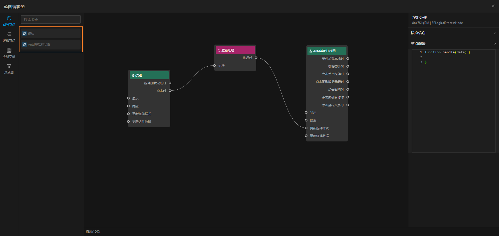

# 图层节点

图层节点列表中的节点数据来自于主设计器上的组件，当你拖拽一个组件到主设计器时，该组件会自动生成一个图层节点。
图层节点于主设计器上的组件是绑定的，当主设计器上的组件是一一对应的

每个图层节点都有固定的输入和输出，分别承担着不同的任务，位于节点左侧的是输入，右侧的是输出。他们对的效果大致可以描述为：

- 输入：可以变更当前组件的状态，比如修改组件属性，隐藏组件、变更组件数据等
- 输出：表示当前组件可以触发的一些动作（事件），比如点击事件，鼠标事件以及其他任意的自定义事件，都可以通过输出传递到蓝图的其他节点上。事件触发时伴随着当前组件的一些数据

> 图层节点的输入通常伴随着修改组件自身的状态，因此需要了解组件本身的一些数据结构
