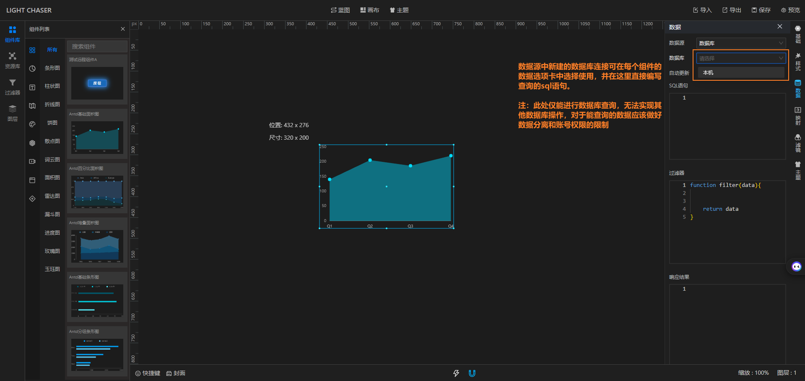

## 总览

数据源管理是LIGHT CHASER中外部公共数据的统一管理入口，你可以在这里操作项目中使用的数据源。目前基础的数据库数据源在开源版和Pro版中都有支持。

而后续计划中LIGHT CHASER会支持更多的数据源，包括 API、MongoDB、Redis、国产关系型数据库、Excel、JSON、WebSocket等等

> 数据源管理需要后端服务的支撑，没有后端服务则数据源管理无法使用

## 数据库数据源

数据库数据源是LIGHT CHASER中已经支持的数据源类型，已经接入的关系型数据库包括

- MySQL
- PostgreSQL
- SQL Server
- Oracle

## 相关视频

#### 动态数据接入

    

        <iframe src="//player.bilibili.com/player.html?isOutside=true&aid=112966095733943&bvid=BV12FebeKE75&cid=500001650579578&p=1&autoplay=0" scrolling="no" border="0" frameborder="no" style="width: 100%; height: 100%;" framespacing="0" allowfullscreen="true"></iframe>
    

