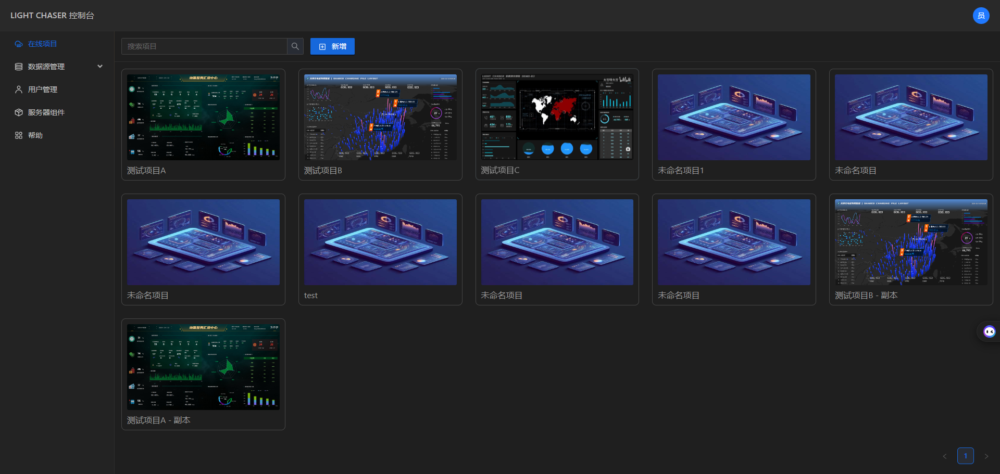
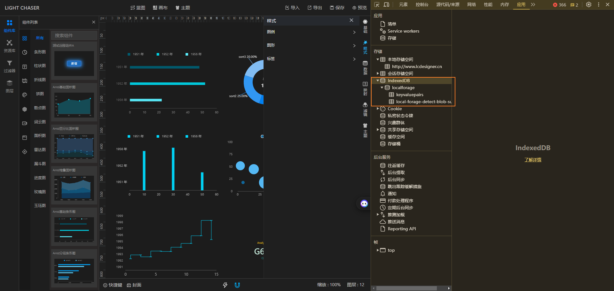
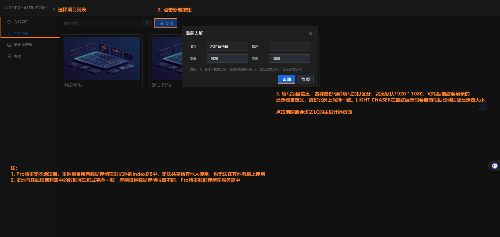
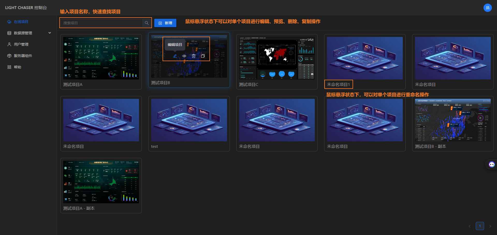

## 总览

项目列表是LIGHT CHASER管理项目的地方，你新建保存后的项目都将在这里显示。

项目列表开源版与Pro版有所不同。在开源版中，同时存在本地项目和在线项目，而Pro版则只有在线项目（也叫项目列表）

## 在线项目

在线项目的所有数据存储在服务器中，因此需要后端服务的配合才能正常使用。通过在线项目选项卡创建的项目会自动存储在服务器中

> LIGHT CHASER已经提供了基础版本的后端服务。
> 你可以直接访问 [LIGHT-CHASER-SERVER](https://github.com/xiaopujun/light-chaser-server)
> 获取最新版的后端源代码，并进行自行编译和部署

## 本地项目

本地项目中的所有数据存储在你浏览器的IndexDB中，这是一个浏览器自带的存储服务。因此所有数据都和你的电脑绑定，本地项目无法与他人分享，只能在本地电脑上使用和访问。
如果你想要将本地项目分享给别人或者将本地项目在其他计算机中打开，你可以将项目数据导出为.json文件。然后在其他电脑上打开LIGHT
CHASER，并导入

## 功能

不管是在线项目还是本地项目，区别仅是存储位置的不同，所拥有的功能是完全一样的。你可以通过在线项目/本地项目列表进行项目的创建、编辑、重命名、预览、复制、删除等操作。

