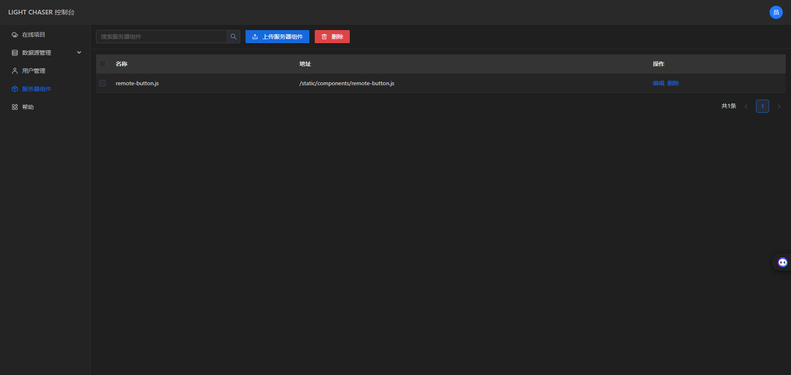
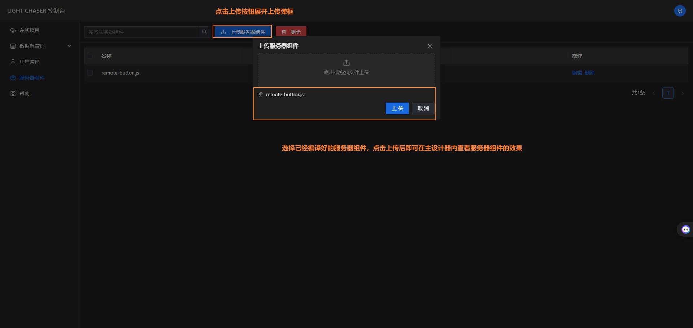
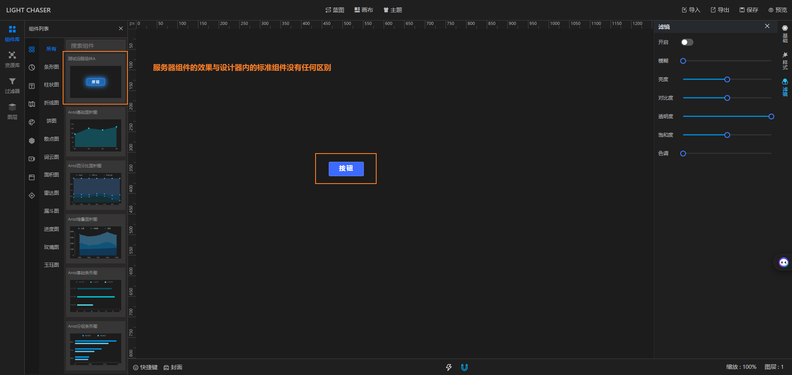

## 总览

服务器组件是Pro版特有的功能，服务器组件的设计目的是为了扩展自定义组件的多样性。他需要配合Pro版本提供的开发脚手架一起使用。

对于开源版的LIGHT CHASER要接入自定义组件唯一的做法是从开源仓库下载源码，然后在源码中增加新的组件。最后再编译重新部署到服务器上才可以使用。而Pro版的服务器组件则打破了该限制。
你仅需要使用Pro版提供的脚手架，和开发普通React组件一样的开发LIGHT CHASER服务器组件，开发完毕后通过脚手架打包编译。然后将编译的产物通过服务器组件上传到LIGHT
CHASER服务器，再进入主设计器， 你会发现自己编写的组件已经出现在主设计器的组件列表中，和标准的组件没有任何区别

## 上传服务器组件

假设你已经开发好了一个服务器组件，并且已经打包编译了。你可以通过下面的方式上传服务器组件。

> 服务器组件的开发过程请查看组件开发章节

