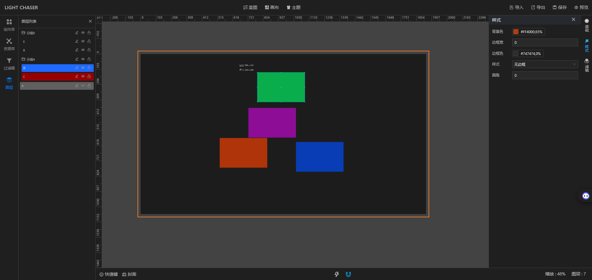
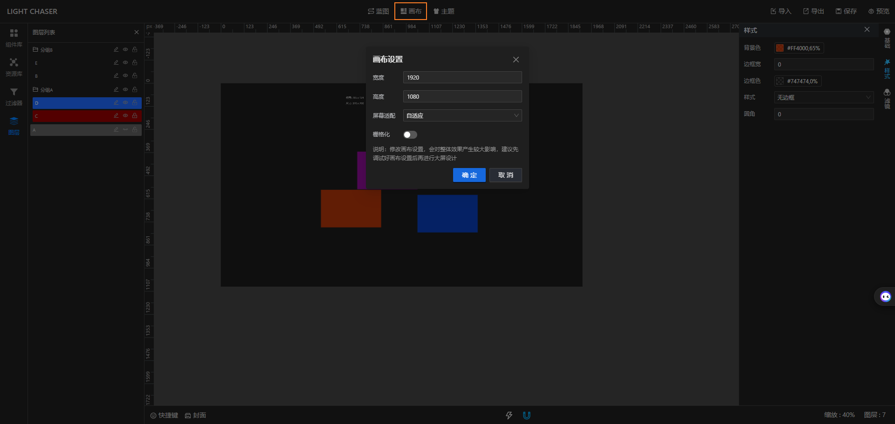
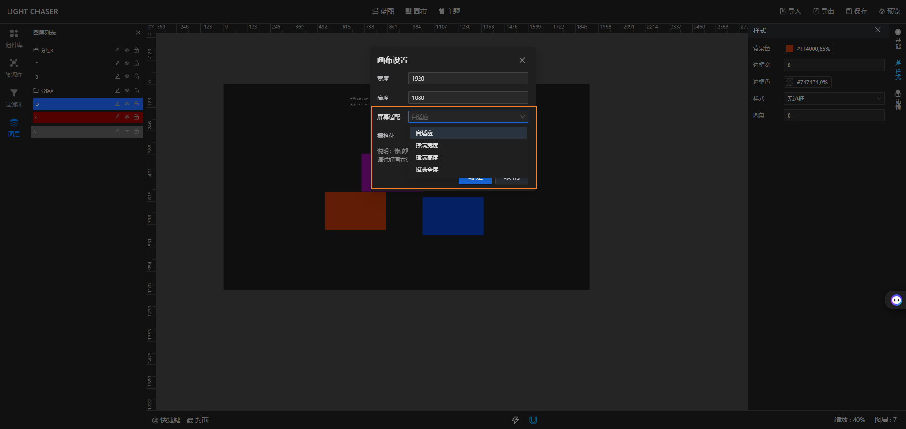
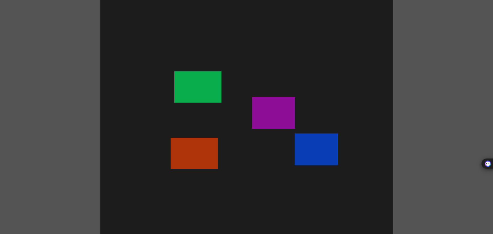
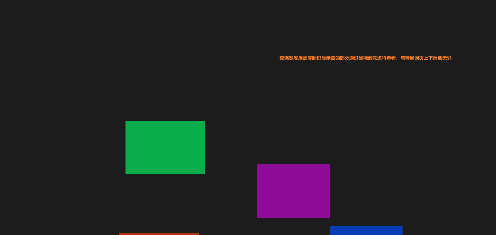
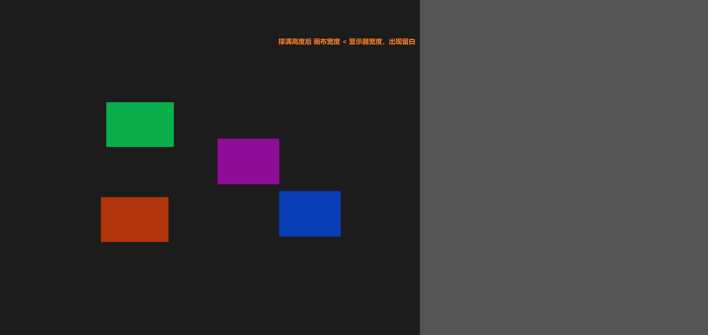
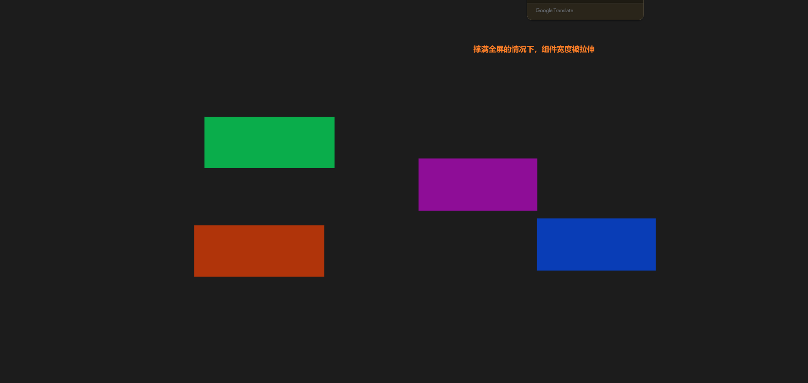
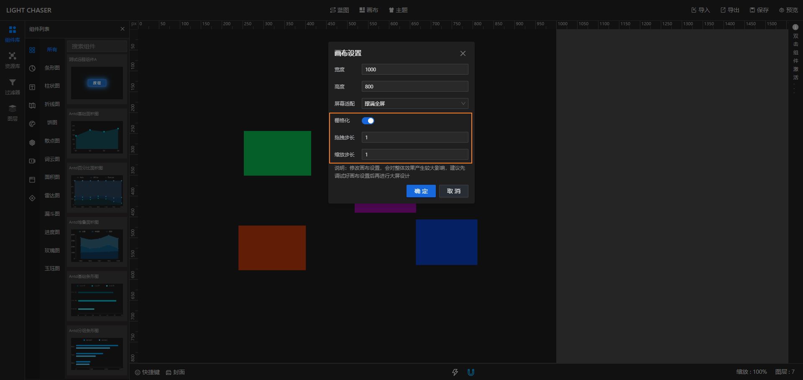
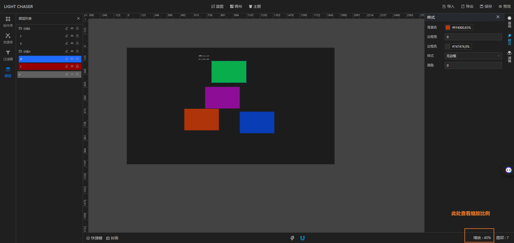

## 总览

主设计器的中间位置即为画布，画布是设计效果最终要呈现的区域。在主设计器中，你可以在画布中填充你需要的组件并设置你想要的效果，预览发布时，画布中的组件会根据你设置的属性进行渲染。

## 画布设置

当你新建完毕一个项目后，会根据你设定的画布尺寸类渲染画布。若后续你需要修改画布尺寸，你可以在顶部的画布设置中进行调整。除此之外你还可以设置一些画布渲染的具体细节

### 画布尺寸

对于画布尺寸，你可以根据你最终要使用的显示器尺寸或者笔记进行设置，设置完成后点击确定，新的画布效果会立即生效

### 屏幕适配

屏幕适配是为了满足最终预览时显示的效果能适配大部分屏幕。其中包含四个选项

#### 自适应

画布会根据显示器的实际比例进行计算，保持画布始终居中渲染。此种情况下，若设置的画布比例与显示器比例不一致时会有留白产生，因此强烈建议画布比例应与显示器比例一致

#### 撑满宽度

此选项下即使画布比例与显示器比例不一致，也会将画布的宽度强行撑满显示器的宽度。撑满的情况下画布高度 < 显示器高度则会留白。反之则会以纵向滚动显示

#### 撑满高度

撑满高度则与撑满宽度对应
，此选项下即使画布比例与显示器比例不一致，也会将画布的高度强行撑满显示器的高度。撑满的情况下画布宽度 <
显示器宽度则会留白。反之则会以横向滚动显示

#### 撑满全屏

此项与前面三项有较大差异，不管画布比例与显示器比例是否一致，都会强行将画布撑满显示器，此选项下不会出现留白问题。但如果画布尺寸比例与显示器尺寸不一致，会出现组件比例失衡。如果尺寸比例一致或者差别不大，则最终展现的组件效果也会符合设计效果

### 栅格化

开启栅格化会影响编辑模式下组件的拖拽和缩放效果。当你的拖拽步长设置为20，则在画布中拖拽组件时，每次移动的最小距离为20像素。缩放步长则影响调整组件尺寸是的最小单位像素。
栅格化可以帮助在设计布局时快速完成整体的布局框架

## 操作画布

画布的操作过程与Photoshop类似：

- 拖拽画布：你可以通过按住鼠标右键不松手，然后移动鼠标进行画布的拖拽。
- 缩放画布：你可以按住alt + 鼠标滑轮进行画布的缩放。缩放是以鼠标指针为中心进行缩放的。可以最大程度满足你缩放哪里查看哪里的需求。

不管画布拖拽还是缩放，画布渲染都是实时进行的，标尺的刻度也是实时更新的。

你可以在画布的右下角观察到当前画布的缩放比例

