## 总览

双击画布中的组件可以激活当前组件的配置，并在右侧的配置菜单中对组件进行详细的配置。

> 注：当你的组件已经编组后，双击组件时，会激活整个编组的配置。如果想激活组中某个组件的配置，请按住shift键，再双击组件。

## 基础

所有的组件都会包含基础设置选项，基础设置会显示当前组件基础信息、尺寸、位置等。

## 样式

每个组件的样式设置面板都各不相同，样式设置面板可以用于调整当前组件展示的效果。

## 数据

#### 静态数据

静态数据是所见即所得的数据配置。你可以直接修改静态数据内容，点击保存后直接查看图表的最新变化

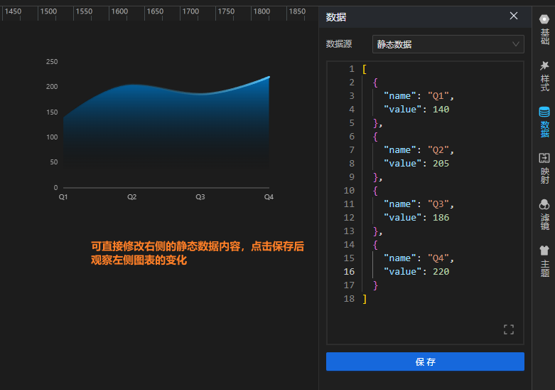

#### API

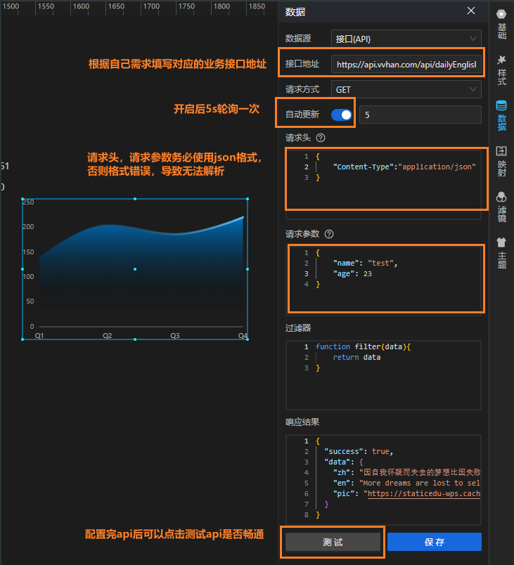

#### 公共API

公共API和API本质上没有任何区别，公共API的配置方式与API基本一致，不同之处在于公共API是进行统一配置，在需要的时候直接选择。

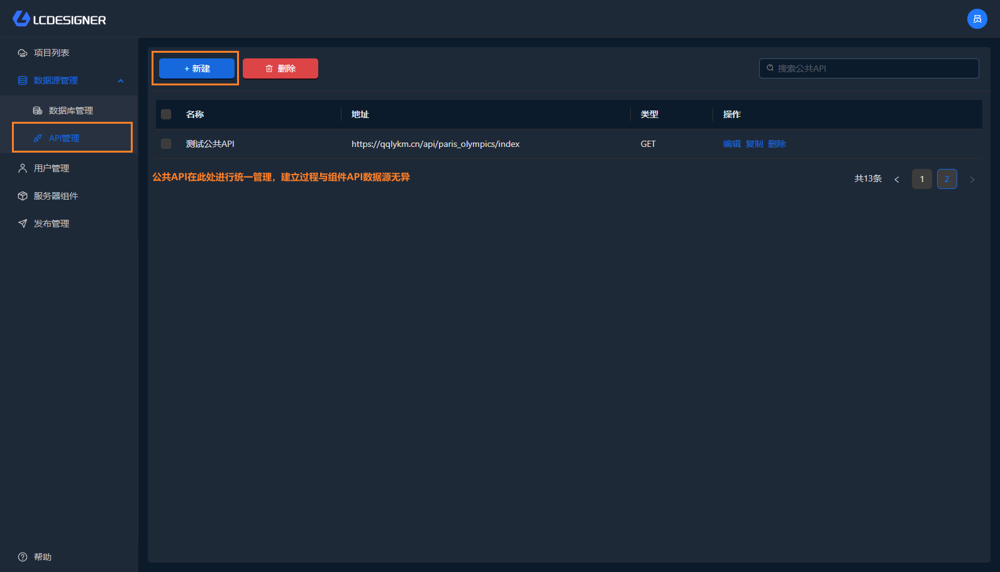

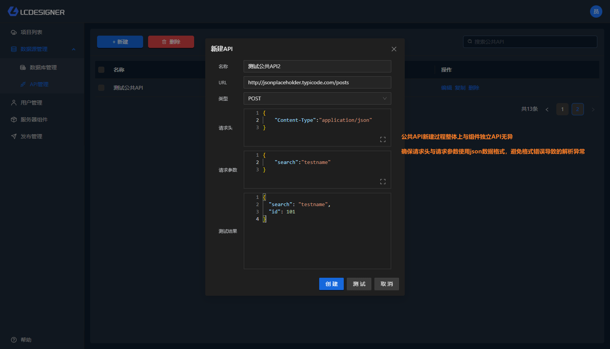

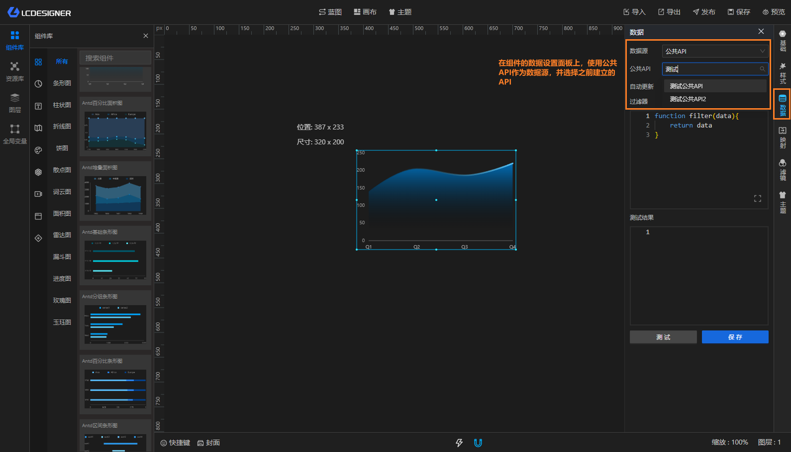

> 注： 公共API的数据并不跟随项目一起存储，而是独立存储在后端服务器中，因此如果你当前的项目使用了公共API，并导出给其他部署了LC的应用使用，则你需要在对应的应用中重新设置公共API并在组件中进行恢复

#### 数据库

数据库的工作模式与公共API类似，他需要在首页的数据源中进行统一的设置，并在需要的组件中直接选择使用。

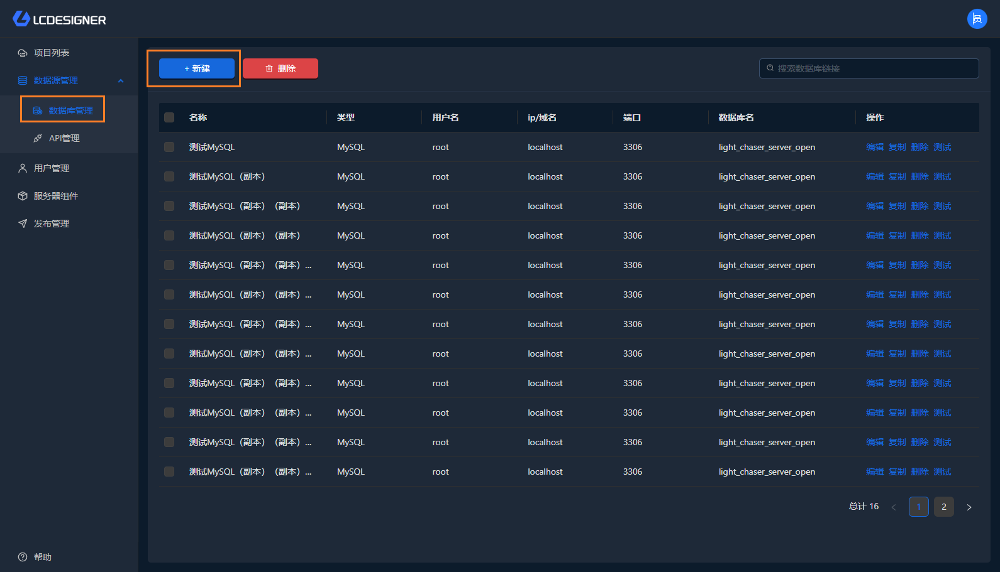

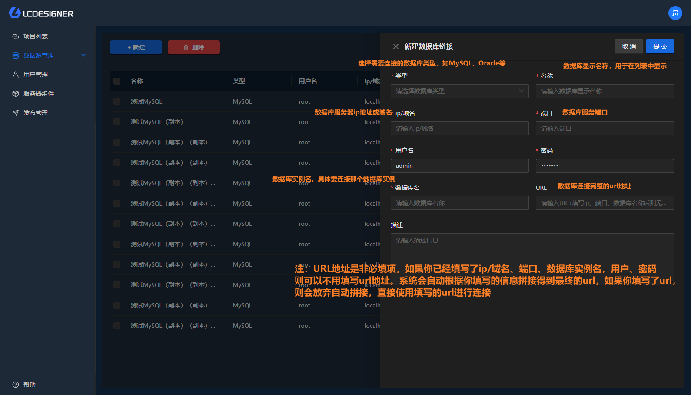

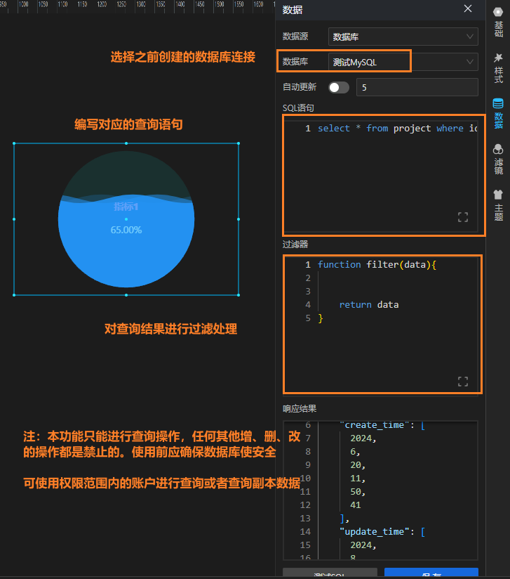

#### 全局变量

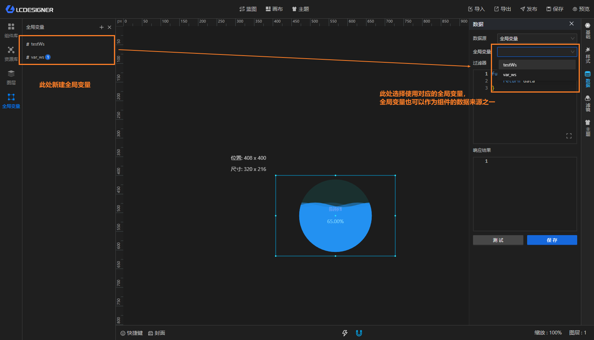

全局变量的详细使用请参考[全局变量](/functions/main_desiner/global_variable)

#### WebSocket

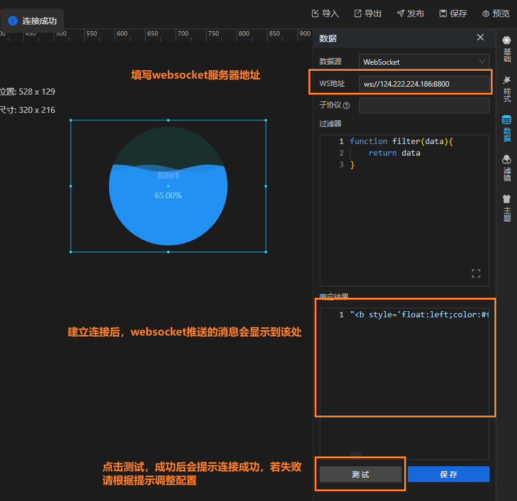

> 注：子协议为非必填选项，不填默认使用ws协议建立数据连接

#### mqtt

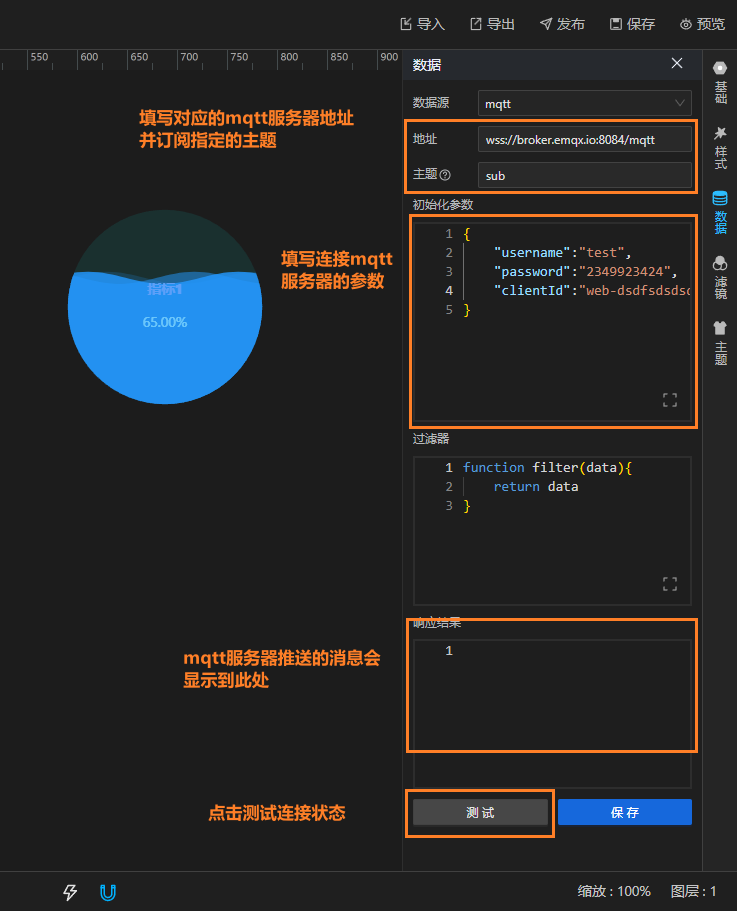

## 映射

一般只有图表组件会有数据映射功能，用来将请求得到的数据对应的属性映射到组件的坐标轴上，映射之后的组件才能正常显示。可结合下图理解映射的方式和作用

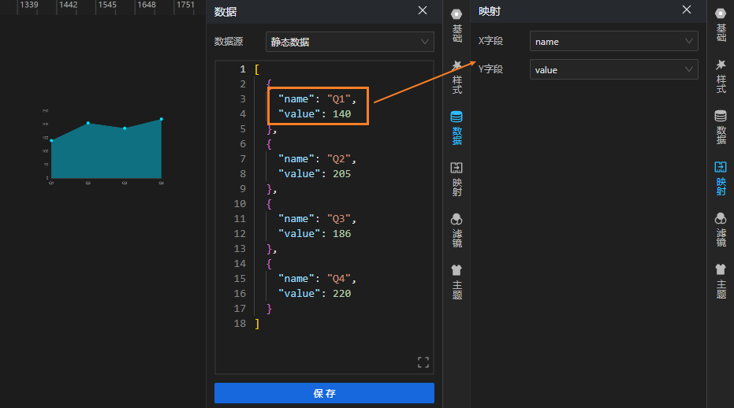

## 滤镜

滤镜功能可以用于快速调整当前组件的整体样式状态，滤镜功能是公共的，所有组件都拥有滤镜功能。

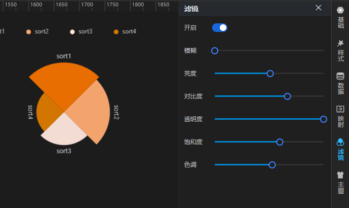

主题功能与滤镜功能类似，均可以快速从整体上修改组件的主体颜色。 但底层的修改逻辑有所不同。

## 主题

## 其他

以上配置项基本为所有组件所共同拥有的。 在此基础上一些比较特殊的组件会拥有自己的配置项。 请根据组件说明文档进行查看。