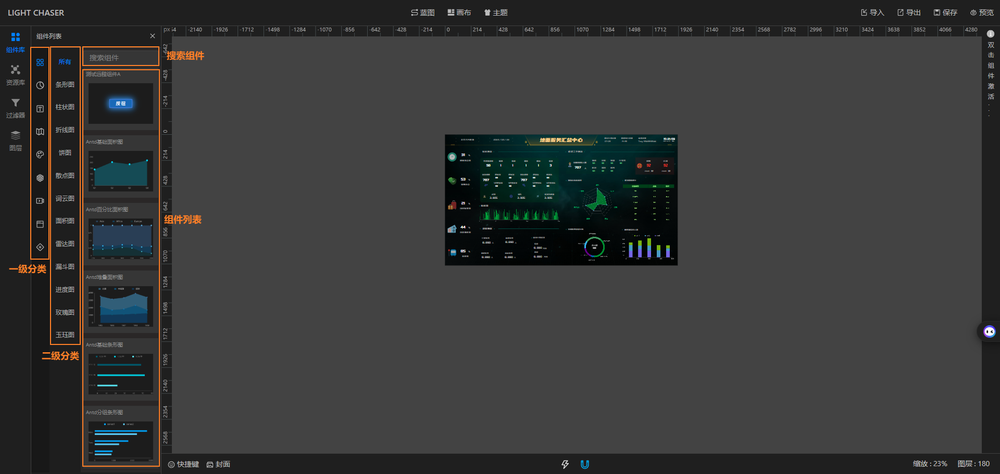

## 总览

组件库将展示light tracer设计器中的所有组件。包括Pro版本中的服务器组件。

组件库包含两层分类结构。 分别是一级分类和二级分类。 一级分类为组件的大类型分类，例如图表、地图、表单控件等。
二级分类为组件的详细分类，例如图表的折线图、柱状图、饼图等。使用过程中，可以通过点击一级分类和二级分类，快速过滤你想要的组件。

## 使用组件

有2种方式将组件展示到画布中

- 直接双击组件列表中的具体组件，双击后组件会在画布的左上角进行渲染
- 直接拖拽组件到画布中。

组件渲染到画布中后，你可继续对其进行操作，如调整组件尺寸和位置。
快捷操作可查看左下角的[快捷键](functions/main_desiner/hotkey.md)说明
若要调整组件效果，请参考[组件配置项](functions/main_desiner/component_config.md)
，若要调整画布，请参考[画布配置项](functions/main_desiner/canvas.md)