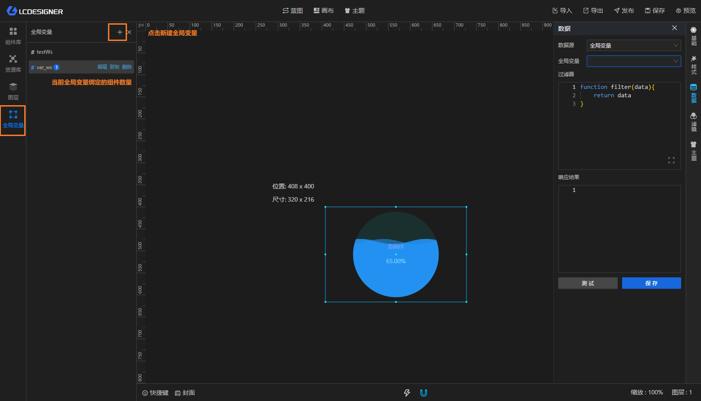
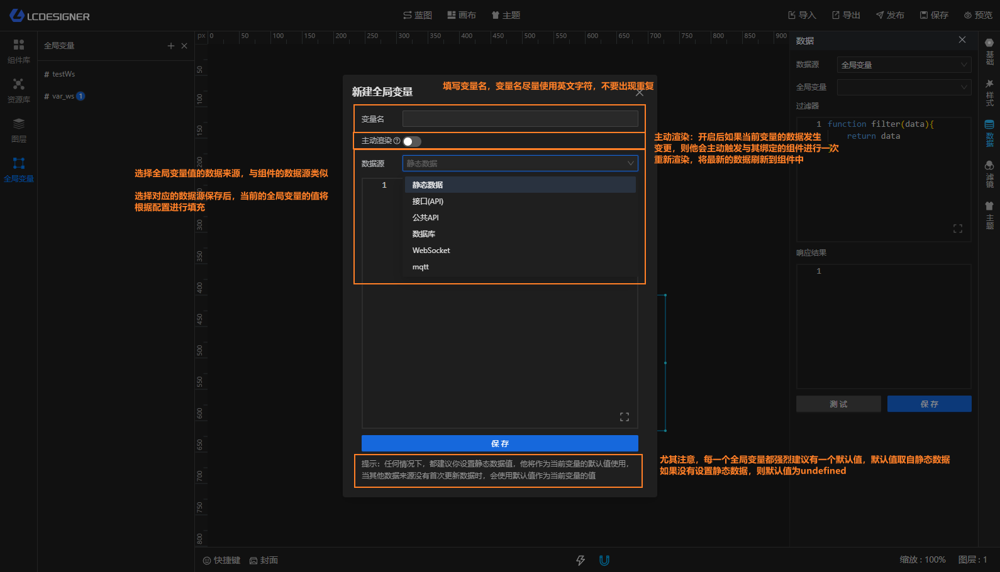
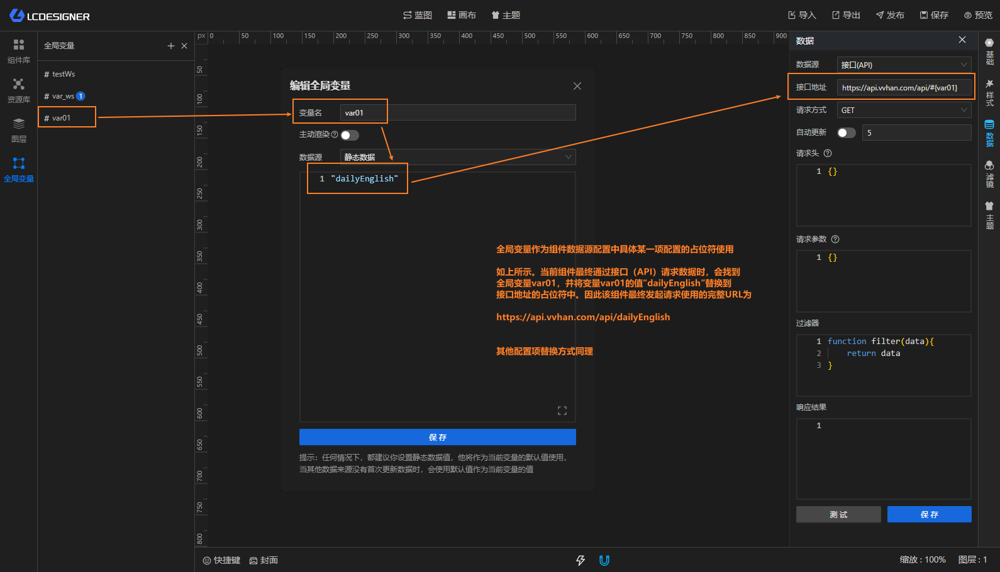
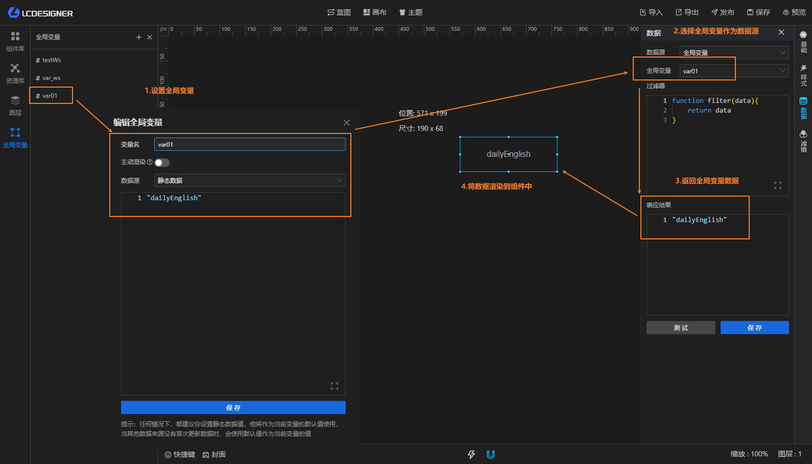
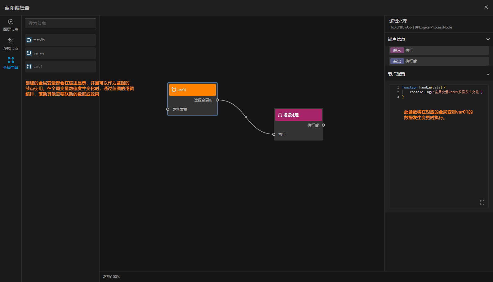

## 全局变量

全局变量主要用于动态的填充组件数据源配置。以及作为数据源之一驱动组件数据变更。

### 新建全局变量

> 只有全局变量新建完成之后，你才可以在对应组件的数据源中去使用它。

### 作为占位符

目前支持在如下配置中使用使用全局变量作为占位符

#### 数据源配置 - 接口（API）

1. 接口地址
2. 请求头
3. 请求参数
4. 过滤器

#### 数据源配置 - 公共API

1. 过滤器

#### 数据源配置 - 数据库

1. SQL语句
2. 过滤器

#### 数据源配置 - WebSocket

1. WS地址
2. 过滤器

#### 数据源配置 - mqtt

1. 地址
2. 主题
3. 过滤器

### 作为数据源

### 作为蓝图节点

