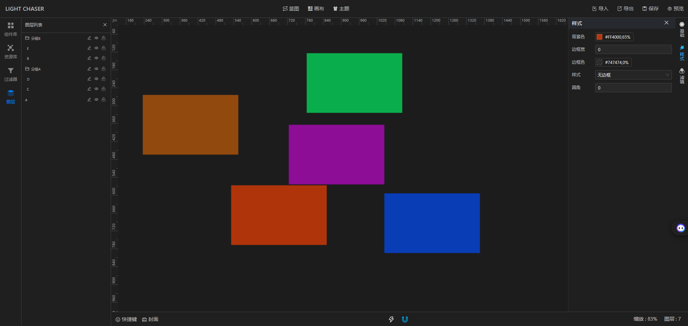
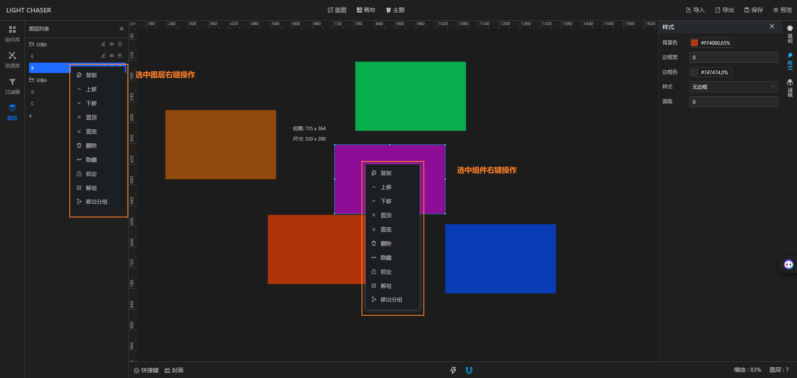
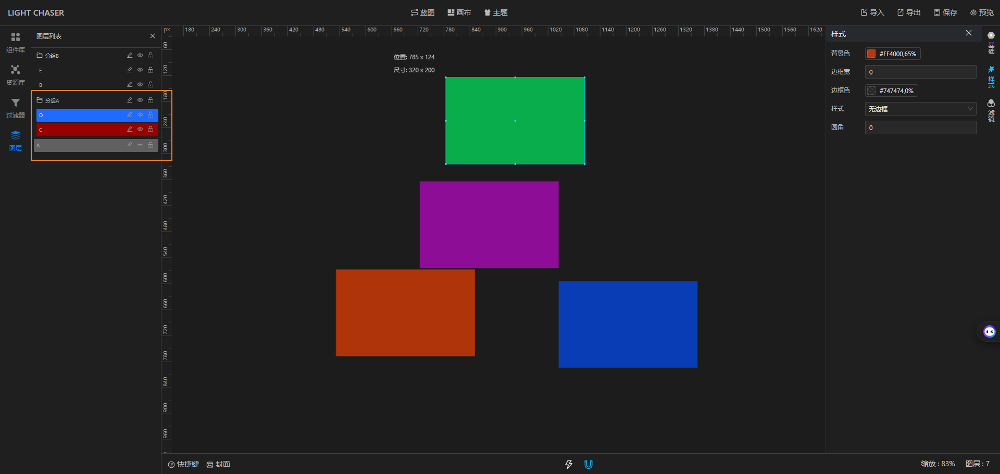

## 总览

图层用于描述画布上组件的层级关系

## 使用

当你将组件拖入画布中时，组件会自动加入图层列表，并位于图层列表的顶层。当图层列表中出现多个图层时，你可以调整他们的上下级关系，并且多个图层之间可以进行组合，已经组合的图层可以从组合中移除，或者将整个组合打散

你可以在图层列表中选中组件，或者在画布中选择组件，然后使用右键菜单中的选项对图层进行操作，或者使用快捷键对图层进行操作。操作图层的前提条件是必须先选中图层

全部的快捷键操作请参考[快捷键](functions/main_desiner/hotkey.md)章节

> 注意：图层的上移、下移、置顶、置底操作均只能在本层级下生效。例如A、B、C、D四个图层处于同一个分组内。则置顶操作只能在这个分组内置顶，而非整个画布置顶

## 图层状态

图层拥有3种状态，不同的状态下图层的表现形式不同。

1. 正常状态：当你将组件拖入画布后，对应的图层是处于正常状态的，可以随意编辑，图层列表中对应图层默认没有颜色，选中时呈现蓝色
2. 锁定状态：当你选中图层时，点击右键菜单中的锁定选项，图层会进入锁定状态，此时图层列表中对应图层会呈现红色，画布中图层无法移动，无法调整大小，但是可以选中
3. 隐藏状态：当你选中图层时，点击右键菜单中的隐藏选项，图层会进入隐藏状态，此时图层列表中对应图层会呈现灰色，画布中图层消失，无法选中。隐藏后的组件只能去图层列表中将其取消隐藏

