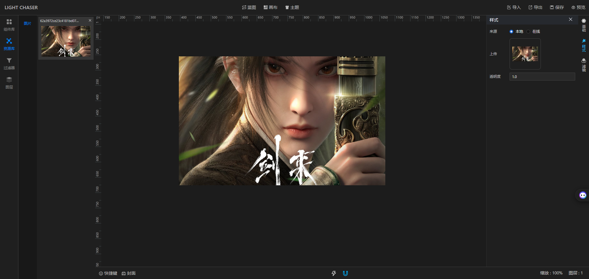
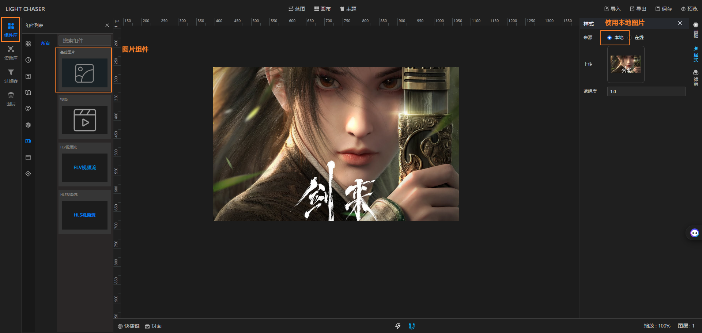

## 总览

资源库位于左侧菜单栏组件库的下方。 资源库是用于存储已经上传的图片资源（或者其他可复用的资源）。 目的是为了实现资源的复用，节省空间，提升性能避免
造成空间浪费。

## 使用

当你使用基础图片组件，并使用本地图片时，上传的图片会自动添加到资源库。资源库中的图片可以像组件一样直接拖拽到画布中使用。如果你重新使用图片组件，并上传了一个之前已经上传的图片，则LIGHT
CHASER会直接使用之前上传到资源库中的图片。并不会将相同的图片重复存储

