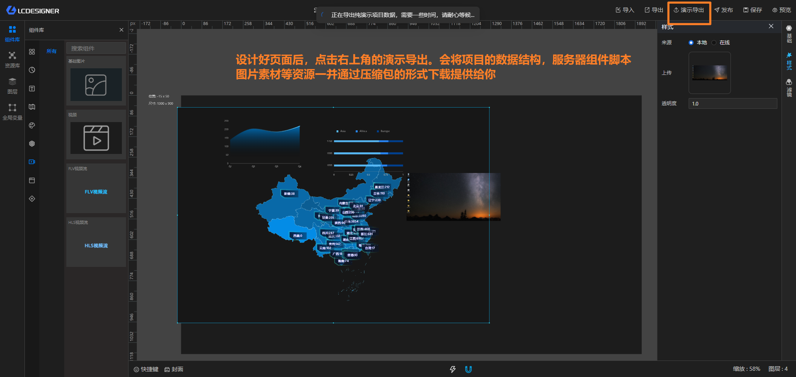
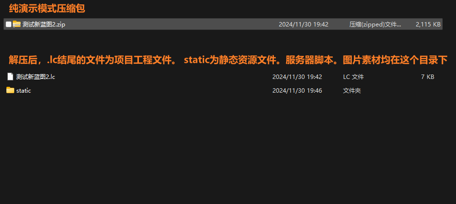
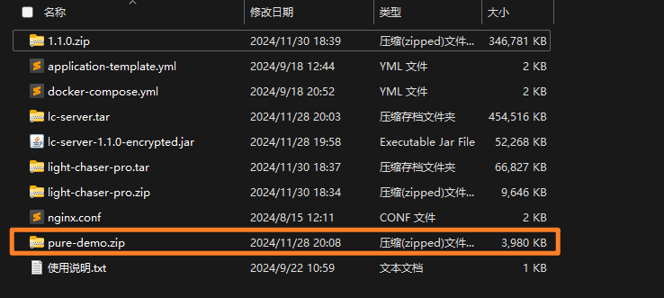
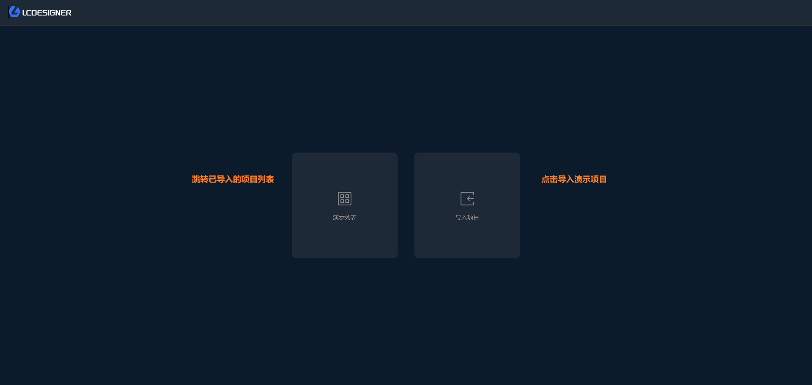
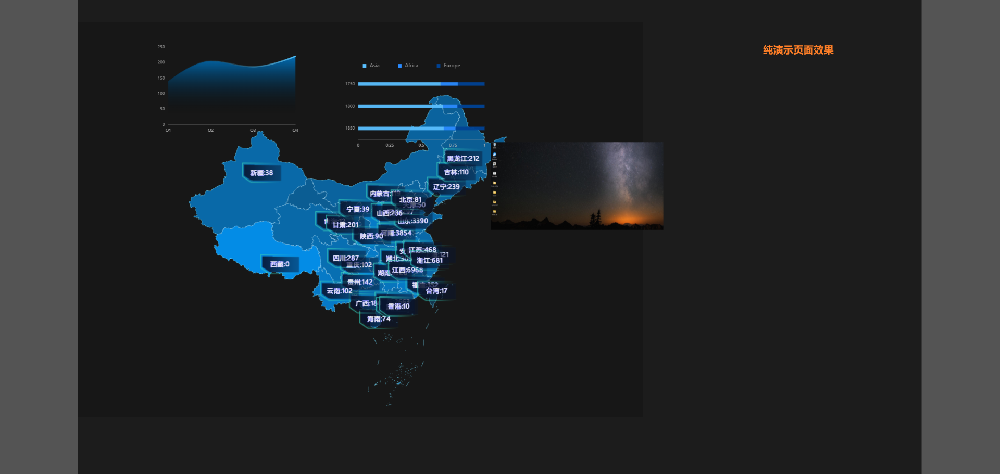

## 纯演示模式

> 纯演示模式自1.1.0版本开始支持

纯演示模式可以支持你将设计好的功能项目直接导出，配合纯演示模式的专属部署包进行精简部署，而不需要部署整个LIGHT CHASER PRO的环境

> 纯演示模式是纯前端部署的方式，因此如果你在设计项目的过程中使用了必须连接后端服务的功能，则在纯演示模式中无法正常使用。这些后端功能包含（数据库数据源、公共api数据源、大屏组件）

## 第一步：导出纯部署项目





## 第二步：部署纯演示环境

跟随LIGHT CHASER PRO部署文件的压缩包内会包含一个pure-demo.zip的压缩文件。该文件用于纯演示环境的搭建。部署过程与部署Pro的前端部分类似。需要nginx服务器



解压该压缩包后，使用nginx部署托管该文件夹。以下是nginx配置nginx配置文件示例

```nginx configuration

#user  nobody;
worker_processes  1;

#error_log  logs/error.log;
#error_log  logs/error.log  notice;
#error_log  logs/error.log  info;

#pid        logs/nginx.pid;


events {
    worker_connections  1024;
}


http {
    include       mime.types;
    default_type  application/octet-stream;

    #log_format  main  '$remote_addr - $remote_user [$time_local] "$request" '
    #                  '$status $body_bytes_sent "$http_referer" '
    #                  '"$http_user_agent" "$http_x_forwarded_for"';

    #access_log  logs/access.log  main;

    sendfile        on;
    #tcp_nopush     on;

    #keepalive_timeout  0;
    keepalive_timeout  65;

    #gzip  on;

    server {
            listen       8500;
            server_name  localhost;
		
            # 替换为pure-demo所在目录的文件路径
    	    root C:/Users/DAGU/Desktop/test-pure-demo/pure-demo;
            index release.html;

            location /static/ {
                alias C:/Users/DAGU/Desktop/test-pure-demo/static/;  # 替换为导出项目压缩包内的static目录所在路径
                # autoindex off;  # 可选，关闭目录浏览功能
            }

            # 将所有非静态资源的请求重定向到 release.html
            location / {
                try_files $uri $uri/ /release.html;
            }

            location @router {
                rewrite ^.*$ /release.html last;
            }

        }

}

```

参考上方配置文件将pure-demo部署启动后访问：http://localhost:8500/release.html 即可看到如下页面



## 第三步：导入项目


