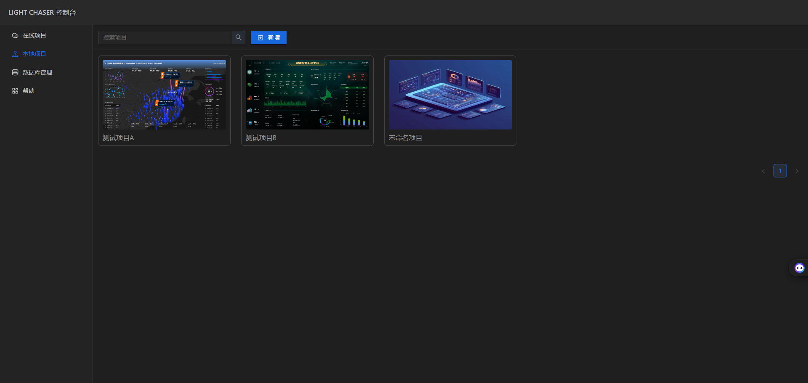
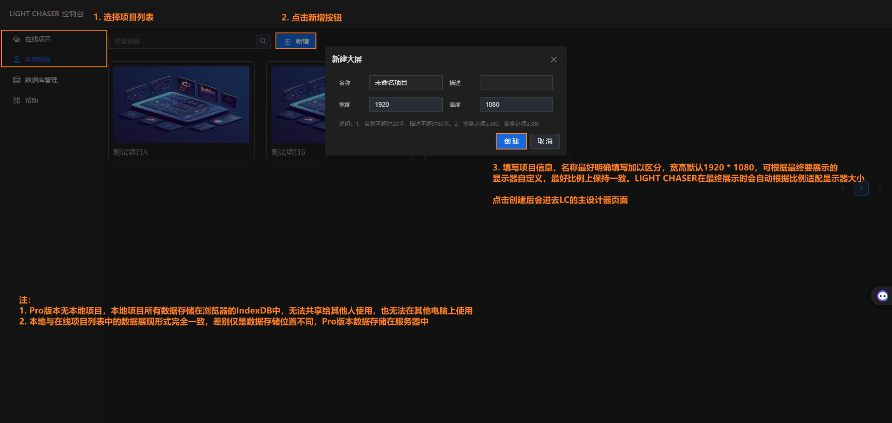
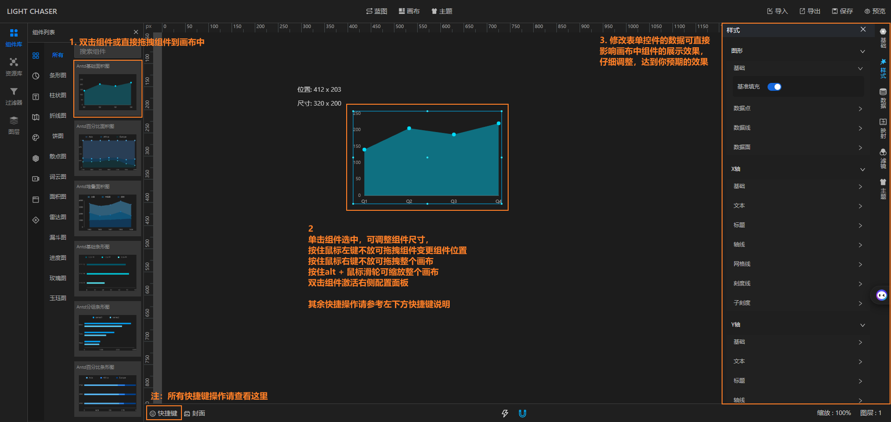
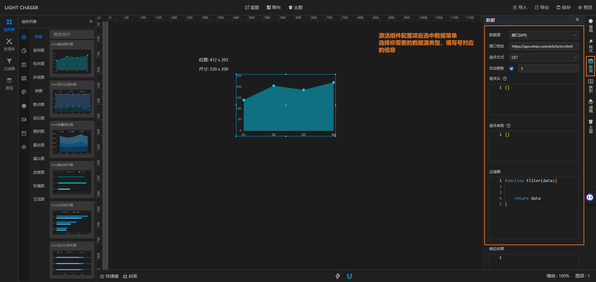
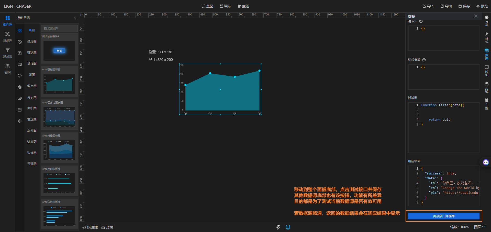
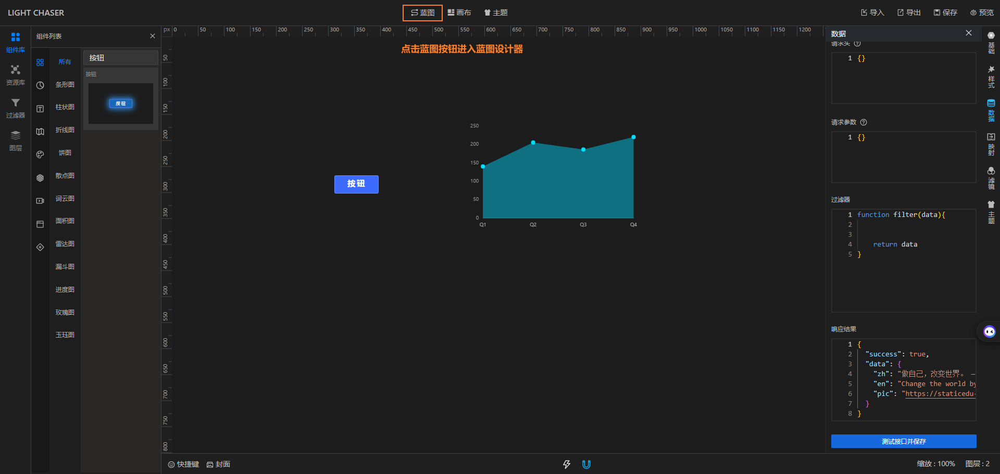
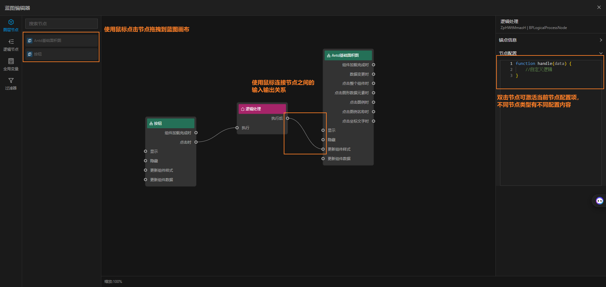
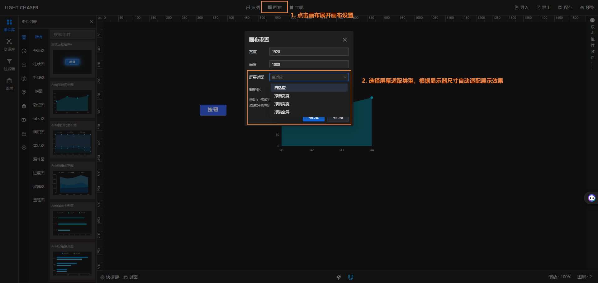
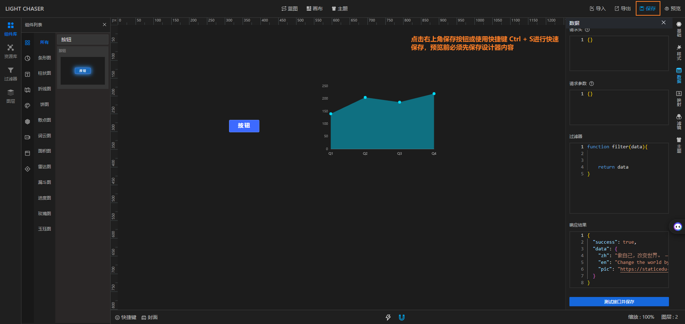
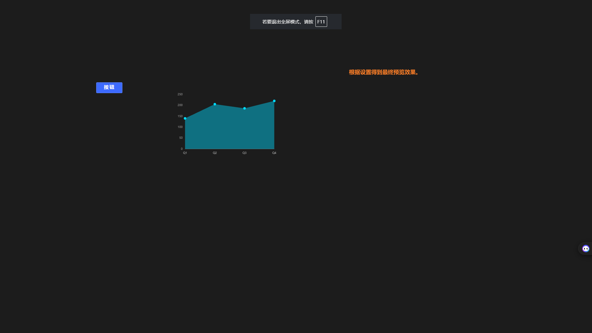

本章节将介绍使用LIGHT CHASER制作一个数据看板的整体流程

## 创建项目

## 设计页面

## 连接数据

## 事件交互

## 预览发布

## 相关视频

#### 软件总览

    

         <iframe src="//player.bilibili.com/player.html?isOutside=true&aid=1552856850&bvid=BV1z1421m7v2&cid=1497691773&p=1&autoplay=0" scrolling="no" border="0" frameborder="no" style="width: 100%; height: 100%;" framespacing="0" allowfullscreen="true"></iframe>
    

#### 动态数据接入

    

        <iframe src="//player.bilibili.com/player.html?isOutside=true&aid=112966095733943&bvid=BV12FebeKE75&cid=500001650579578&p=1&autoplay=0" scrolling="no" border="0" frameborder="no" style="width: 100%; height: 100%;" framespacing="0" allowfullscreen="true"></iframe>
    

